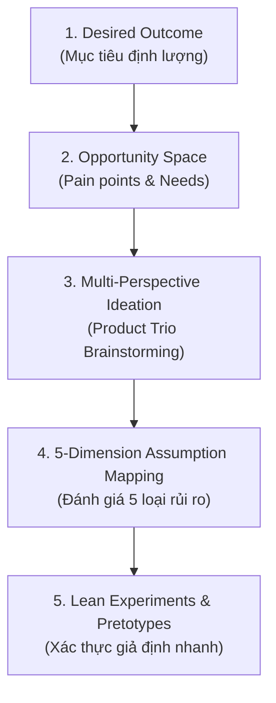

# Product Discovery Framework Cho Hệ Thống Quản Lý Máy Chủ Proxy (HCProxy)

## 1. Mục Đích & Bối Cảnh
Skill này cung cấp quy trình và công cụ để đội ngũ sản phẩm (Product Trio: PM + Tech/Network Lead + UI/UX Designer) khám phá, đánh giá và xác thực các nhu cầu người dùng trong hệ sinh thái máy chủ proxy **HCProxy** trước khi bắt tay vào lập trình.

Mục tiêu cốt lõi: **Xây dựng đúng thứ cần thiết (Building the right thing), tránh bẫy nhảy ngay vào giải pháp kỹ thuật khi chưa xác thực cơ hội và rủi ro.**

---

## 2. Quy Trình Khám Phá 5 Bước (Continuous Discovery)



### Bước 1: Xác Định Desired Outcome (Mục Tiêu Trọng Tâm)
Tập trung vào 1 kết quả kinh doanh hoặc chỉ số sản phẩm đo lường được (liên kết với OKRs).
- **Ví dụ mục tiêu hạ tầng**: "Tăng tỷ lệ kết nối proxy thành công lên 99.8% trong 90 ngày tới."
- **Ví dụ mục tiêu trải nghiệm người dùng di động**: "Giảm thời gian kết nối và chuyển đổi proxy node trên Mobile App xuống dưới 3 giây."
- **Ví dụ mục tiêu mở rộng quy mô**: "Hỗ trợ 20,000 phiên proxy đồng thời (concurrent sessions) mà latency overhead duy trì < 20ms."

### Bước 2: Khám Phá & Đánh Giá Không Gian Cơ Hội (Opportunity Space)
Khách hàng không mua proxy; họ mua **khả năng kết nối an toàn, ẩn danh, không bị chặn và tốc độ cao**.
Khung cơ hội phải được định dạng theo góc nhìn của người dùng (Customer / Developer Perspective):
- *"Tôi gặp khó khăn khi phát hiện node proxy nào đang bị nghẽn mạng để chuyển sang node khác."*
- *"Tôi e ngại dữ liệu truy cập và DNS của tôi bị rò rỉ (DNS leaks) khi proxy bất ngờ mất kết nối."*
- *"Tôi cần tự động xoay IP (IP rotation) theo từng request khi thu thập dữ liệu web (crawling/scraping)."*

**Công thức xếp hạng độ ưu tiên cơ hội (Dan Olsen - Opportunity Score):**
$$\text{Opportunity Score} = \text{Importance} + \max(\text{Importance} - \text{Satisfaction}, 0)$$
*(Hoặc chuẩn hóa $Importance \times (1 - Satisfaction)$ trên thang điểm 0 - 1)*

### Bước 3: Phát Ý Tưởng Đa Chiều (Product Trio Ideation)
Trước mỗi cơ hội ưu tiên hàng đầu, Product Trio phải đề xuất tối thiểu 3 phương án giải pháp khác nhau:
1. **Góc nhìn PM**: Tối ưu giá trị người dùng, gói cước băng thông, phân loại node VIP vs Standard.
2. **Góc nhìn Network/Systems Engineer**: Sử dụng eBPF, TCP BBR congestion control, kết nối WireGuard tunnel, HAProxy dynamic backend reload.
3. **Góc nhìn Mobile Designer**: UI biểu đồ latency thời gian thực, nút Quick-Switch Node 1 chạm, cảnh báo Kill-Switch khi ngắt kết nối.

### Bước 4: Ma Trận Rủi Ro 5 Chiều Cho Hệ Thống Proxy (Assumption Mapping)
Kiểm tra giải pháp qua 5 chiều rủi ro đặc thù của hạ tầng proxy:

| Chiều Rủi Ro | Câu Hỏi Cốt Lõi | Rủi Ro Điển Hình Trong Dự Án HCProxy |
| :--- | :--- | :--- |
| **1. Value Risk** | Người dùng có thực sự cần và sẵn sàng dùng/trả tiền cho tính năng này không? | Khách hàng có cần tính năng chọn node theo thành phố hay chỉ cần theo quốc gia? |
| **2. Usability Risk** | Người dùng có thể dễ dàng hiểu, cấu hình và sử dụng tính năng này không? | Việc cài đặt chứng chỉ HTTPS CA hoặc cấu hình SOCKS5 trên ứng dụng di động có quá phức tạp? |
| **3. Feasibility Risk** | Đội ngũ kỹ thuật có khả năng xây dựng, vận hành và scale giải pháp này không? | ProxyServer có đáp ứng nổi 50,000 concurrent sockets? Giới hạn file descriptors (`ulimit`) và RAM overhead? |
| **4. Viability Risk** | Giải pháp có phù hợp với mô hình kinh doanh, pháp lý và chi phí hạ tầng không? | Chi phí egress bandwidth từ nhà cung cấp VPS/Cloud có làm thâm hụt ngân sách? Chính sách chống lạm dụng (Abuse/DMCA). |
| **5. Security & Reliability** | Giải pháp có bảo mật, chống rò rỉ dữ liệu và duy trì tính ổn định cao không? | Rủi ro DNS leak, IPv6 leak, WebRTC leak, lỗ hổng xác thực trên API Gateway, nguy cơ bị biến thành open proxy botnet. |

### Bước 5: Thiết Kế Thử Nghiệm Tinh Gọn (Pretotyping & Lean Experiments)
Áp dụng nguyên lý **Make sure you are building the right 'it' before you build 'it' right** (Alberto Savoia):
- **XYZ Hypothesis Template**: *"Ít nhất **X%** của nhóm đối tượng **Y** sẽ thực hiện hành động **Z** (đo lường hành vi thực tế)."*
  - *Ví dụ*: "Ít nhất 40% người dùng thử nghiệm tính năng web crawler sẽ chọn gói IP Pool xoay vòng tự động thay vì gán IP tĩnh."
- **Kỹ thuật Pretotype ứng dụng cho HCProxy**:
  - *Fake Door Test*: Đặt nút toggle "Auto Failover to WireGuard" trên giao diện Mobile App. Khi người dùng bấm, hiển thị thông báo "Tính năng đang được kích hoạt cho cụm node của bạn, đăng ký nhận bản early access". Đo lường Click-through rate (CTR).
  - *Concierge MVP*: Admin thực hiện cấu hình xoay IP thủ công cho 5 khách hàng VIP trước khi code hệ thống orchestration tự động phức tạp.

---

## 3. Template Báo Cáo Discovery (Discovery Plan Output)

Khi hoàn thành phiên khám phá, xuất kết quả theo định dạng sau:

```markdown
# Product Discovery Summary: [Tên Cơ Hội / Tính Năng]

- **Desired Outcome**: [Chỉ số định lượng cần đạt được]
- **Target Persona**: [Đối tượng người dùng: e.g. Data Crawler Developer / Mobile Privacy User]
- **Top 3 Opportunities Identified**:
  1. [Opportunity 1 + Opportunity Score]
  2. [Opportunity 2 + Opportunity Score]
  3. [Opportunity 3 + Opportunity Score]
- **Selected Solution Hypothesis**: [Mô tả vắn tắt phương án được chọn]
- **Critical Assumptions (Leap of Faith)**:
  - [Assumptions nhóm Feasibility/Security hoặc Value có độ không chắc chắn cao nhất]
- **Experiment Design (Pretotype)**:
  - **Hypothesis**: Ít nhất X% người dùng Y sẽ thực hiện Z
  - **Method**: [Fake door / Prototype test / Shadow traffic]
  - **Metric & Threshold**: [e.g. Conversion rate >= 30%]
  - **Timeframe & Effort**: [e.g. 3 ngày, low effort]
- **Next Step Decision**:
  - Nếu Đạt: Chuyển sang viết PRD chuẩn (`prd-standard`).
  - Nếu Không Đạt: Pivot sang phương án giải pháp khác hoặc hủy bỏ.
```
