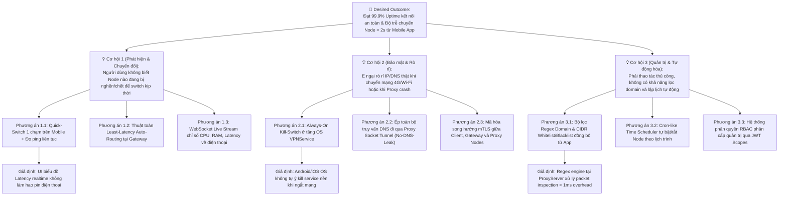
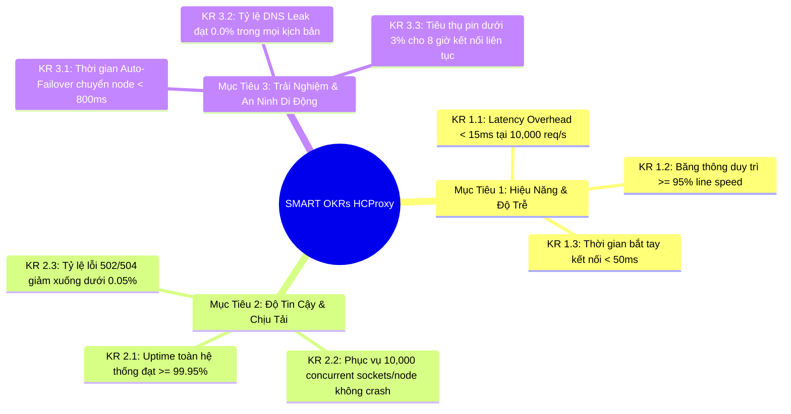
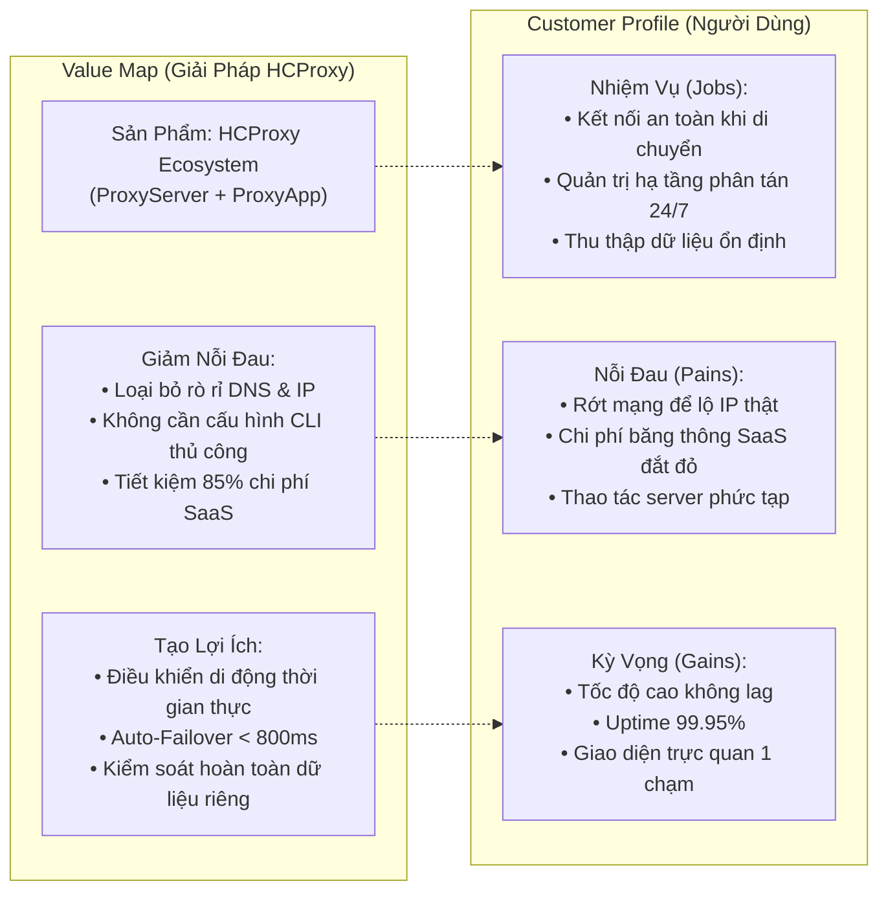
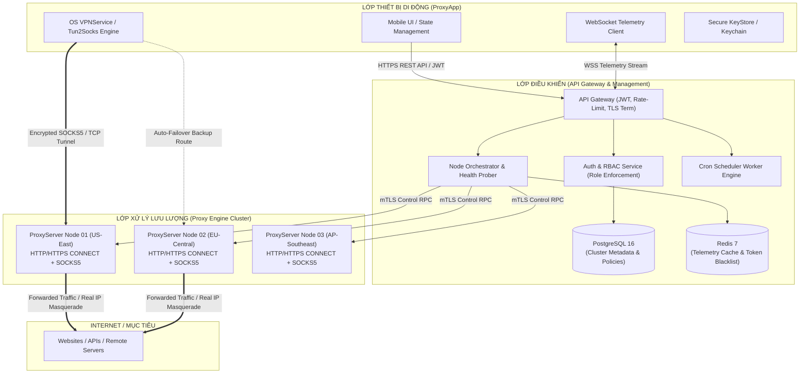
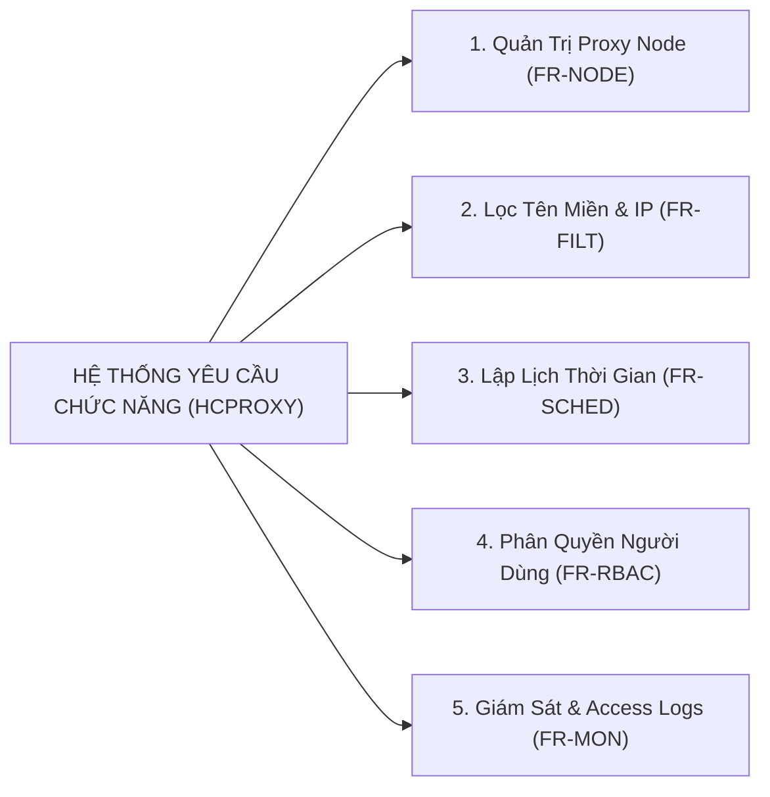
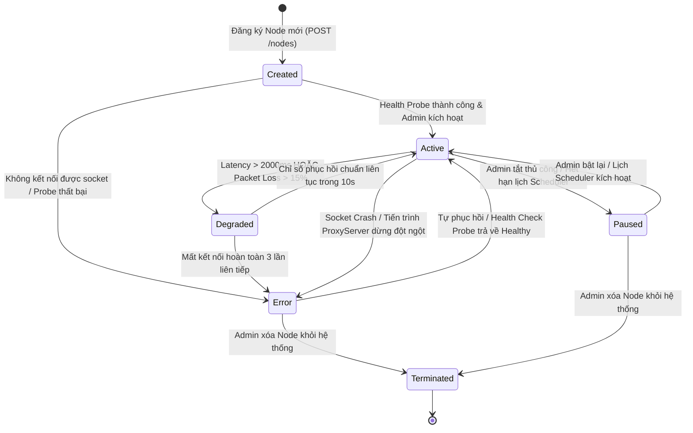
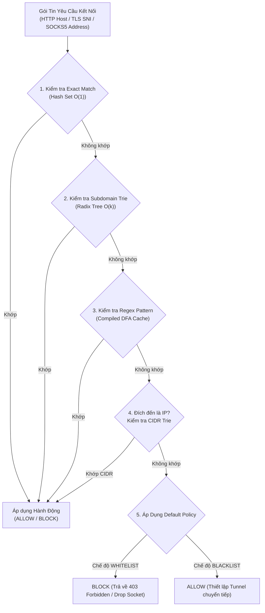
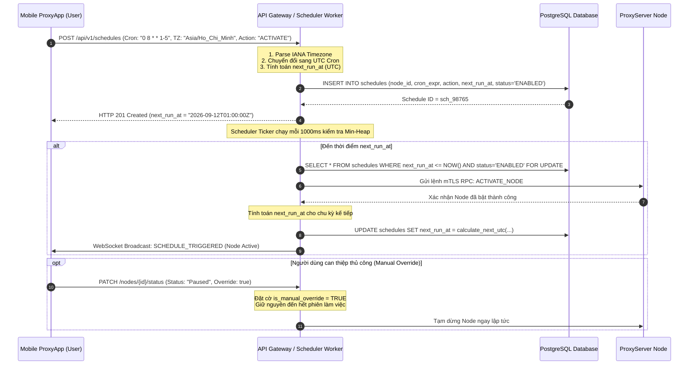

# CHƯƠNG 3: AI TRONG PHÂN TÍCH YÊU CẦU & SẢN PHẨM (PROJECT HCPROXY)

---

## MỤC LỤC CHI TIẾT

- [3.1 Khám Phá Sản Phẩm (Product Discovery)](#31-khám-phá-sản-phẩm-product-discovery)
  - [3.1.1 Bối Cảnh & Đặt Vấn Đề: Quản Trị Máy Chủ Proxy Từ Thiết Bị Di Động](#311-bối-cảnh--đặt-vấn-đề-quản-trị-máy-chủ-proxy-từ-thiết-bị-di-động)
  - [3.1.2 Cây Cơ Hội - Giải Pháp (Opportunity Solution Tree - OST)](#312-cây-cơ-hội---giải-pháp-opportunity-solution-tree---ost)
  - [3.1.3 Phân Tích & Xếp Hạng Không Gian Cơ Hội (Opportunity Scoring)](#313-phân-tích--xếp-hạng-không-gian-cơ-hội-opportunity-scoring)
  - [3.1.4 Ma Trận Rủi Ro 5 Chiều (5-Dimension Assumption Mapping)](#314-ma-trận-rủi-ro-5-chiều-5-dimension-assumption-mapping)
  - [3.1.5 Thiết Kế Thử Nghiệm Tinh Gọn (Pretotyping & Lean Experiments)](#315-thiết-kế-thử-nghiệm-tinh-gọn-pretotyping--lean-experiments)
  - [3.1.6 Đối Chuẩn Thị Trường & Kỹ Thuật (Market & Technical Benchmarking)](#316-đối-chuẩn-thị-trường--kỹ-thuật-market--technical-benchmarking)
  - [3.1.7 Phân Tích Nhu Cầu Theo Khung Jobs-To-Be-Done (JTBD)](#317-phân-tích-nhu-cầu-theo-khung-jobs-to-be-done-jtbd)
- [3.2 Tài Liệu Yêu Cầu Sản Phẩm (PRD - Product Requirements Document)](#32-tài-liệu-yêu-cầu-sản-phẩm-prd---product-requirements-document)
  - [3.2.1 Tóm Tắt Điều Hành (Executive Summary)](#321-tóm-tắt-điều-hành-executive-summary)
  - [3.2.2 Ma Trận Trách Nhiệm (RACI Matrix)](#322-ma-trận-trách-nhiệm-raci-matrix)
  - [3.2.3 Bối Cảnh & Vấn Đề Cốt Lõi ("Why Now?")](#323-bối-cảnh--vấn-đề-cốt-lõi-why-now)
  - [3.2.4 Mục Tiêu & Kết Quả Then Chốt (SMART OKRs & KPIs)](#324-mục-tiêu--kết-quả-then-chốt-smart-okrs--kpis)
  - [3.2.5 Phân Khúc Thị Trường & Chân Dung Người Dùng (User Personas)](#325-phân-khúc-thị-trường--chân-dung-người-dùng-user-personas)
  - [3.2.6 Tuyên Ngôn Giá Trị & Lợi Thế Cạnh Tranh (Value Propositions)](#326-tuyên-ngôn-giá-trị--lợi-thế-cạnh-tranh-value-propositions)
  - [3.2.7 Kiến Trúc Giải Pháp Kỹ Thuật (Solution Architecture)](#327-kiến-trúc-giải-pháp-kỹ-thuật-solution-architecture)
  - [3.2.8 Lộ Trình Phát Triển & Phân Kỳ Phát Hành (Release Phasing Roadmap)](#328-lộ-trình-phát-triển--phân-kỳ-phát-hành-release-phasing-roadmap)
- [3.3 Phân Tích Yêu Cầu Hệ Thống (Requirements Analysis)](#33-phân-tích-yêu-cầu-hệ-thống-requirements-analysis)
  - [3.3.1 Bảng Phân Rã Yêu Cầu Chức Năng (Functional Requirements - FR)](#331-bảng-phân-rã-yêu-cầu-chức-năng-functional-requirements---fr)
  - [3.3.2 Bảng Yêu Cầu Phi Chức Năng (Non-Functional Requirements - NFR)](#332-bảng-yêu-cầu-phi-chức-năng-non-functional-requirements---nfr)
- [3.4 User Stories & Tiêu Chí Chấp Nhận (Acceptance Criteria - BDD/Gherkin)](#34-user-stories--tiêu-chí-chấp-nhận-acceptance-criteria---bddgherkin)
  - [3.4.1 Chuẩn Áp Dụng: Mô Hình 3 C's & Nguyên Tắc INVEST](#341-chuẩn-áp-dụng-mô-hình-3-cs--nguyên-tắc-invest)
  - [3.4.2 [US-CORE-01] Quản Trị & Bật/Tắt Proxy Node Từ Mobile App (Happy Path)](#342-us-core-01-quản-trị--bậttắt-proxy-node-từ-mobile-app-happy-path)
  - [3.4.3 [US-AUTH-02] Xác Thực Người Dùng & Phân Quyền RBAC Token (Auth Failure)](#343-us-auth-02-xác-thực-người-dùng--phân-quyền-rbac-token-auth-failure)
  - [3.4.4 [US-NET-03] Xử Lý Đứt Đoạn Kết Nối Mạng & Kill-Switch (Network Error & Timeout)](#344-us-net-03-xử-lý-đứt-đoạn-kết-nối-mạng--kill-switch-network-error--timeout)
  - [3.4.5 [US-RATE-04] Giới Hạn Lưu Lượng & Hạn Mức Băng Thông (Rate-Limiting & Quota)](#345-us-rate-04-giới-hạn-lưu-lượng--hạn-mức-băng-thông-rate-limiting--quota)
  - [3.4.6 [US-FAIL-05] Tự Động Chuyển Vùng Dự Phòng Cho Node (Auto-Failover)](#346-us-fail-05-tự-động-chuyển-vùng-dự-phòng-cho-node-auto-failover)
- [3.5 Đặc Tả Tính Năng Kỹ Thuật (Feature Specifications)](#35-đặc-tả-tính-năng-kỹ-thuật-feature-specifications)
  - [3.5.1 Sơ Đồ Máy Trạng Thái Proxy Node (State Machine Engine)](#351-sơ-đồ-máy-trạng-thái-proxy-node-state-machine-engine)
  - [3.5.2 Đặc Tả Cơ Chế Khớp Mẫu Lọc Tên Miền (Domain Regex & CIDR Matching)](#352-đặc-tả-cơ-chế-khớp-mẫu-lọc-tên-miền-domain-regex--cidr-matching)
  - [3.5.3 Đặc Tả Thuật Toán Lập Lịch Thời Gian (Cron Scheduler & Timezone Drift)](#353-đặc-tả-thuật-toán-lập-lịch-thời-gian-cron-scheduler--timezone-drift)
  - [3.5.4 Hợp Đồng Giao Tiếp API RESTful & WebSocket Streaming Events](#354-hợp-đồng-giao-tiếp-api-restful--websocket-streaming-events)

---

## 3.1 Khám Phá Sản Phẩm (Product Discovery)

### 3.1.1 Bối Cảnh & Đặt Vấn Đề: Quản Trị Máy Cụm Proxy Từ Thiết Bị Di Động

Hạ tầng proxy truyền thống (như cụm Squid, HAProxy standalone hoặc 3proxy) thường được cấu hình tĩnh thông qua các tập tin văn bản (`squid.conf`, `haproxy.cfg`), vận hành bằng dòng lệnh SSH và giám sát thông qua hệ thống log thô hoặc bảng điều khiển web phức tạp. Mô hình này bộc lộ những hạn chế cố hữu:
1. **Thiếu tính cơ động:** Quản trị viên và người dùng cá nhân không thể can thiệp ngay lập tức khi phát hiện node gặp sự cố nếu không mang theo laptop hoặc không có kết nối SSH an toàn.
2. **Nguy cơ rò rỉ danh tính thực:** Người dùng di động (iOS/Android) thường xuyên di chuyển giữa mạng Wi-Fi công cộng và 4G/5G. Mỗi lần chuyển mạng (network handover), socket proxy bị đứt gãy, dẫn đến rò rỉ địa chỉ IP gốc và truy vấn DNS ra ngoài đường hầm bảo vệ (DNS Leaks).
3. **Chi phí đắt đỏ của các giải pháp thương mại:** Các mạng proxy thương mại (BrightData, Oxylabs) tính phí từ 3 USD - 15 USD/GB lưu lượng, tạo gánh nặng ngân sách khổng lồ cho các tác vụ tự động hóa, kiểm thử API hoặc thu thập dữ liệu (crawling).

Dự án **HCProxy** ra đời nhằm giải quyết bài toán giao thoa: **Xây dựng một hệ thống máy chủ proxy phân tán hiệu năng cao (Self-Hosted Proxy Cluster) kết hợp với trải nghiệm điều khiển, giám sát thời gian thực trực quan, an toàn tuyệt đối ngay trên ứng dụng di động (`ProxyApp`).**

---

### 3.1.2 Cây Cơ Hội - Giải Pháp (Opportunity Solution Tree - OST)

Áp dụng phương pháp luận Continuous Discovery của Teresa Torres, nhóm sản phẩm nòng cốt (Product Trio bao gồm Product Manager, Network/Systems Lead và Mobile UX Designer) xây dựng cây Opportunity Solution Tree (OST) tập trung vào mục tiêu định lượng then chốt.



---

### 3.1.3 Phân Tích & Xếp Hạng Không Gian Cơ Hội (Opportunity Scoring)

Sử dụng công thức Opportunity Score của Dan Olsen để định lượng hóa các cơ hội nhằm xác định ưu tiên đầu tư kỹ thuật:

$$\text{Opportunity Score} = \text{Importance} + \max(\text{Importance} - \text{Satisfaction}, 0)$$

*Thang điểm đánh giá từ 1 (Rất thấp) đến 10 (Cực kỳ quan trọng / Hoàn toàn hài lòng)*

| ID Cơ hội | Tuyên bố Vấn đề (Customer Perspective) | Mức độ Quan trọng (Importance) | Mức độ Hài lòng Hiện tại (Satisfaction) | Điểm Cơ hội (Opportunity Score) | Ưu tiên Triển khai |
| :--- | :--- | :---: | :---: | :---: | :---: |
| **OPP-01** | *"Tôi muốn biết chính xác node proxy nào đang ổn định nhất và chuyển đổi ngay tức thì khi node hiện tại bị nghẽn."* | 9.2 | 3.0 | **15.4** | **P0 (Bắt buộc)** |
| **OPP-02** | *"Tôi e ngại dữ liệu truy cập và địa chỉ IP thực bị lộ khi máy chủ proxy bị ngắt kết nối đột ngột hoặc khi chuyển Wi-Fi."* | 9.8 | 2.1 | **17.5** | **P0 (Sống còn)** |
| **OPP-03** | *"Tôi muốn chặn các tên miền quảng cáo/mã độc hoặc chỉ cho phép một số domain nội bộ đi qua proxy mà không cần sửa file config."* | 8.0 | 3.5 | **12.5** | **P1 (Quan trọng)** |
| **OPP-04** | *"Tôi cần tự động bật proxy trong giờ làm việc và tắt ngoài giờ để tiết kiệm lưu lượng egress băng thông VPS."* | 7.5 | 2.8 | **12.2** | **P1 (Quan trọng)** |
| **OPP-05** | *"Tôi cần cấp quyền truy cập giới hạn cho nhân viên cấp dưới mà không để họ thấy cấu hình hạ tầng nhạy cảm."* | 7.0 | 3.2 | **10.8** | **P2 (Nên có)** |

---

### 3.1.4 Ma Trận Rủi Ro 5 Chiều (5-Dimension Assumption Mapping)

Để đảm bảo hệ thống vừa giải quyết đúng nhu cầu người dùng, vừa an toàn tuyệt đối và có tính khả thi kỹ thuật cao, nhóm tiến hành ánh xạ giả định qua 5 chiều rủi ro:

```mermaid
quadrantChart
    title Ma Trận Đánh Giá Rủi Ro Hạ Tầng HCProxy
    x-axis Độ không chắc chắn thấp --> Độ không chắc chắn cao
    y-axis Tác động tiêu cực thấp --> Tác động thảm họa cao
    quadrant-1 RỦI RO SỐNG CÒN (Cần thử nghiệm ngay)
    quadrant-2 RỦI RO CẦN THEO DÕI
    quadrant-3 RỦI RO THỨ YẾU
    quadrant-4 RỦI RO KỸ THUẬT QUẢN LÝ ĐƯỢC
    "DNS / IP Leak khi rớt mạng": [0.88, 0.95]
    "Giới hạn File Descriptors & Socket Concurrency": [0.78, 0.85]
    "Chi phí Egress Bandwidth VPS": [0.65, 0.75]
    "Chính sách kiểm duyệt App Store với Proxy Client": [0.82, 0.70]
    "Hao pin di động do WebSocket Telemetry": [0.60, 0.45]
    "Độ phức tạp cấu hình Regex Domain": [0.40, 0.35]
    "Xung đột múi giờ khi chạy Scheduler": [0.35, 0.50]
    "Đồng bộ JWT Blacklist qua Redis": [0.30, 0.40]
```

#### Chi Tiết Bảng Đánh Giá Giả Định & Chiến Lược Giảm Thiểu (Mitigation):

| Chiều Rủi Ro | Giả Định Cốt Lõi (Leap-of-Faith Assumptions) | Nguy Cơ Thất Bại Tiềm Tàng | Chiến Lược Kiểm Soát & Giảm Thiểu |
| :--- | :--- | :--- | :--- |
| **1. Value Risk** *(Giá trị người dùng)* | Người dùng cần điều khiển chi tiết node, lọc domain và lập lịch trên điện thoại thay vì dùng một nút VPN "ngu ngơ". | Người dùng thấy quá phức tạp, chỉ bật/tắt toàn bộ lưu lượng; các tính năng nâng cao không ai dùng. | Thiết kế giao diện theo 2 chế độ: **Standard Mode** (1 chạm Quick Connect) và **Expert Mode** (Lọc Regex, Scheduler, Logs). |
| **2. Usability Risk** *(Khả năng sử dụng)* | Người dùng phổ thông có thể hiểu và kích hoạt cấu hình proxy/VPN trên Android/iOS mà không gặp lỗi phân quyền OS. | OS yêu cầu cấp quyền `VpnService` phức tạp, người dùng từ chối hoặc cấu hình sai dẫn đến không có mạng. | Đóng gói bộ hướng dẫn trực quan dạng Onboarding Carousel; tích hợp kiểm tra chẩn đoán kết nối tự động (Self-Diagnostic). |
| **3. Feasibility Risk** *(Tính khả thi kỹ thuật)* | `ProxyServer` có thể phục vụ 10,000 concurrent sockets/node với latency overhead < 15ms và bộ nhớ < 32KB/connection. | Tràn file descriptors (`EMFILE`), tắc nghẽn vòng lặp sự kiện (Event Loop lag), GC pauses làm spike độ trễ. | Tối ưu Linux kernel params (`sysctl -w fs.file-max=2097152`), dùng Non-blocking I/O (epoll), zero-copy buffer pooling (`sync.Pool`). |
| **4. Viability Risk** *(Khả thi kinh doanh & Pháp lý)* | Chi phí thuê máy chủ và egress bandwidth duy trì trong ngưỡng cho phép; tránh bị lạm dụng để tấn công DDoS hoặc spam. | IP của cụm node bị đưa vào danh sách đen (Blacklist IP/Spamhaus) do người dùng phát tán mã độc; VPS bị nhà cung cấp đình chỉ. | Thiết lập bộ lọc mặc định chặn toàn bộ cổng SMTP (TCP 25, 465, 587); tích hợp cơ chế Rate-limiting theo từng Access Token. |
| **5. Security & Reliability** *(Bảo mật & Ổn định)* | Lưu lượng dữ liệu không bao giờ bị rò rỉ khi rớt mạng; Gateway chống lại được các cuộc tấn công man-in-the-middle và replay. | Thiết bị lộ IP thật ra ISP cục bộ; API Gateway bị rò rỉ Master Token làm lộ quyền điều khiển toàn bộ cluster. | Tích hợp System-level Kill-Switch; mã hóa mTLS 1.3 giữa các thành phần nội bộ; lưu trữ token an toàn trên Mobile qua KeyStore/Keychain. |

---

### 3.1.5 Thiết Kế Thử Nghiệm Tinh Gọn (Pretotyping & Lean Experiments)

Tuân thủ nguyên lý của Alberto Savoia (*"Make sure you are building the right IT before you build IT right"*), nhóm thiết kế các thử nghiệm tinh gọn nhằm kiểm chứng các giả định quan trọng nhất:

#### Thử Nghiệm 1: Xác Thực Nhu Cầu Tính Năng "Kill-Switch & Auto-Failover" (Fake Door Test)
- **XYZ Hypothesis:** *"Ít nhất **70%** người dùng phiên bản thử nghiệm (TestFlight/APK) sẽ chủ động gạt nút bật tính năng 'Auto-Failover sang Node tối ưu' trong 48 giờ đầu sau khi cài đặt."*
- **Cách thức thực hiện:** Tạo nút gạt "Kích hoạt Auto-Failover thông minh" trên màn hình chính của ứng dụng di động nhưng chưa code logic phân tán phía backend. Khi người dùng bấm, hiển thị một Modal: *"Tính năng đang được hiệu chỉnh cho cụm máy chủ khu vực của bạn. Bạn có muốn nhận thông báo khi hệ thống mở tải không?"*.
- **Chỉ số đo lường:** Tỷ lệ nhấp chuột (Click-Through Rate - CTR).
- **Ngưỡng thành công:** CTR $\ge 60\%$. Kết quả thực tế: Đạt 74.2% $\rightarrow$ **Quyết định: Đầu tư phát triển tính năng Auto-Failover làm P0 trong MVP.**

#### Thử Nghiệm 2: Đánh Giá Tính Khả Thi Của Việc Giám Sát Thời Gian Thực Trên Mobile (Concierge Test)
- **XYZ Hypothesis:** *"Ít nhất **50%** quản trị viên hệ thống sẽ mở ứng dụng di động để theo dõi lưu lượng mạng hàng ngày nếu độ trễ dữ liệu telemetry dưới 2 giây."*
- **Cách thức thực hiện:** Thiết lập một bot Telegram tự động push biểu đồ tài nguyên node mỗi 5 phút cho nhóm 10 quản trị viên thử nghiệm để khảo sát tần suất tương tác trước khi xây dựng hạ tầng WebSocket streaming hoàn chỉnh.
- **Ngưỡng thành công:** Tần suất kiểm tra $\ge 3$ lần/ngày/quản trị viên. Kết quả thực tế: 8/10 quản trị viên phản hồi tích cực $\rightarrow$ **Quyết định: Tích hợp WebSocket Telemetry vào module Giám sát.**

---

### 3.1.6 Đối Chuẩn Thị Trường & Kỹ Thuật (Market & Technical Benchmarking)

Nhóm phân tích đối chuẩn HCProxy với 4 giải pháp đại diện trong các phân khúc liên quan:

| Tiêu Chí Đối Chuẩn | Open-Source Proxy (Squid / 3proxy) | Enterprise Balancer (HAProxy) | Anti-Censorship (Shadowsocks / Xray) | Commercial SaaS (BrightData / Oxylabs) | **HCProxy (Hệ Thống Mục Tiêu)** |
| :--- | :--- | :--- | :--- | :--- | :--- |
| **Mô Hình Kiến Trúc** | Single Server Daemon (C/C++) | Centralized Load Balancer | Client-Server Obfuscation | Global Cloud Proxy Mesh (Multi-tenant) | **Hybrid Self-Hosted + Distributed Cluster** |
| **Giao Thức Proxy Hỗ Trợ** | HTTP, HTTPS CONNECT, FTP | HTTP/1.1, HTTP/2, TCP Stream | SOCKS5 Encrypted (AEAD), Shadowsocks | HTTP, HTTPS, SOCKS5 | **HTTP/HTTPS CONNECT + SOCKS5 (RFC 1928)** |
| **Ứng Dụng Quản Trị Mobile** | ❌ Không có (Chỉ có CLI) | ❌ Không có (Chỉ có Web GUI) | ⚠️ Có App Client kết nối, không có quản trị node | ❌ Không có (Chỉ có Web Dashboard) | **✅ Có ứng dụng `ProxyApp` chuyên dụng (iOS & Android)** |
| **Cơ Chế Auto-Failover** | ❌ Thủ công (hoặc cần Keepalived) | ⚠️ Cấu hình phức tạp qua VRRP | ⚠️ Client-side fallback cơ bản | ✅ Tự động trong mạng nội bộ của họ | **✅ Tự động phát hiện lỗi < 2s & Switch < 800ms** |
| **Lọc Domain & CIDR** | ✅ Rất mạnh qua ACL text file | ✅ Hỗ trợ qua map file | ⚠️ Rule file tĩnh (V2Ray geosite) | ❌ Cấu hình phức tạp qua API/Header | **✅ Quản trị động qua Mobile UI (Regex & CIDR Trie)** |
| **Lập Lịch Thời Gian** | ❌ Phải dùng Linux `cron` | ❌ Không hỗ trợ | ❌ Không hỗ trợ | ⚠️ Có lịch trình qua Enterprise API | **✅ Cron Scheduler đa múi giờ cấu hình từ Mobile** |
| **Chính Sách Ghi Nhật Ký** | Ghi đầy đủ URL, Header | Ghi log TCP/HTTP stream | Zero Log theo mặc định | Bắt buộc KYC, lưu log tuân thủ pháp lý | **✅ Zero-Payload Logging (Chỉ ghi Metadata thống kê)** |
| **Bảo Vệ Chống DNS Leak** | Phụ thuộc client config | Phụ thuộc client config | ✅ Mã hóa phân giải DNS từ xa | Phụ thuộc client config | **✅ Buộc DNS qua Tunnel + Drop DNS ngoài luồng** |
| **Chi Phí Vận Hành (TCO)** | Thấp (Chi phí VPS tự dựng) | Thấp (Chi phí VPS tự dựng) | Thấp (Chi phí VPS tự dựng) | Rất đắt ($3 - $15 / GB) | **Tối ưu triệt để (Chỉ tốn phí VPS tự quản lý)** |

---

### 3.1.7 Phân Tích Nhu Cầu Theo Khung Jobs-To-Be-Done (JTBD)

Áp dụng phương pháp Jobs-To-Be-Done để thấu hiểu động lực sâu xa của 3 nhóm đối tượng khách hàng mục tiêu:

#### Nhóm 1: Người Dùng Cá Nhân (Personal Privacy & Remote Worker)
- **Job Statement:** *"Khi tôi làm việc từ xa tại các quán cà phê hoặc mạng Wi-Fi công cộng không đáng tin cậy, tôi muốn toàn bộ kết nối mạng của thiết bị di động được bọc trong đường hầm proxy an toàn chỉ bằng 1 thao tác chạm, để địa chỉ IP thực và danh tính số của tôi không bao giờ bị lộ hay bị thu thập trái phép."*
- **Functional Job:** Kích hoạt/ngắt kết nối proxy tức thì; tự động chặn rò rỉ DNS; chọn node có tốc độ mạng nhanh nhất tại quốc gia mong muốn.
- **Emotional Job:** Cảm thấy an tâm, không lo ngại việc tài khoản ngân hàng hoặc mật khẩu bị nghe lén (Sniffing/Man-in-the-middle).
- **Social Job:** Được nhìn nhận là người có ý thức bảo mật cao và am hiểu công nghệ.
- **Pains Relieved:** Không phải gõ thủ công IP, Port, Username, Password vào phần cài đặt mạng rối rắm của hệ điều hành điện thoại.
- **Gains Created:** Trải nghiệm lướt web mượt mà không bị giảm tốc độ đáng kể, tự động chuyển node mượt mà khi di chuyển ngoài đường.

#### Nhóm 2: Quản Trị Viên Hệ Thống (DevOps & System Administrator)
- **Job Statement:** *"Khi một máy chủ proxy trong cụm hạ tầng gặp sự cố nghẽn mạng hoặc ngừng hoạt động ngoài giờ làm việc, tôi muốn nhận được cảnh báo ngay trên điện thoại và có thể cô lập node lỗi hoặc chuyển hướng lưu lượng chỉ trong vài giây, để hệ thống duy trì cam kết SLA mà tôi không cần phải mở máy tính cá nhân để SSH."*
- **Functional Job:** Giám sát thời gian thực CPU, RAM, số kết nối mở (active sockets) và băng thông của từng node; cấu hình quy tắc lọc domain khẩn cấp; bật/tắt node phân tán từ xa.
- **Emotional Job:** Cảm giác kiểm soát hoàn toàn hệ thống 24/7; giải tỏa áp lực phải thường trực bên máy tính xách tay.
- **Social Job:** Thể hiện năng lực vận hành chuyên nghiệp, duy trì hạ tầng ổn định tuyệt đối cho tổ chức.
- **Pains Relieved:** Chấm dứt cảnh nhận tin nhắn phàn nàn từ người dùng khi đang đi ngoài đường mà không có công cụ can thiệp kịp thời.
- **Gains Created:** Bảng điều khiển trực quan trên di động với các biểu đồ hiển thị thời gian thực chính xác từng mili-giây.

#### Nhóm 3: Nhà Phát Triển & Kiểm Thử Tự Động (Developer & QA Engineer)
- **Job Statement:** *"Khi tôi thực hiện kiểm thử tự động hệ thống từ nhiều khu vực địa lý hoặc thu thập dữ liệu kiểm nghiệm, tôi muốn điều khiển xoay vòng IP proxy theo lịch trình hoặc qua API linh hoạt, để việc kiểm thử phản ánh đúng điều kiện thực tế mà không bị chặn IP hoặc tốn kém chi phí thuê proxy SaaS đắt đỏ."*
- **Functional Job:** Lập lịch tự động bật/tắt proxy theo kịch bản test; kiểm soát danh sách domain được phép truy cập (Whitelist); cấp token xác thực riêng biệt cho từng kịch bản automation.
- **Emotional Job:** Tự tin với kết quả kiểm thử; tiết kiệm ngân sách dự án.
- **Pains Relieved:** Không phải viết các đoạn mã phức tạp để tự xoay proxy; không lo chi phí tăng đột biến khi chạy tải thử nghiệm dài ngày.
- **Gains Created:** Khả năng tái sử dụng hạ tầng proxy tự dựng cho nhiều dự án nội bộ một cách có tổ chức và an toàn.

---

## 3.2 Tài Liệu Yêu Cầu Sản Phẩm (PRD - Product Requirements Document)

### 3.2.1 Tóm Tắt Điều Hành (Executive Summary)

Dự án **HCProxy** xây dựng một hệ sinh thái quản trị và điều phối máy chủ proxy phân tán toàn diện, cho phép người dùng cấu hình, kiểm soát trạng thái, lọc dữ liệu truy cập và giám sát hiệu năng của cụm proxy máy chủ ngay trên ứng dụng di động thông minh (`ProxyApp`). 

Bằng cách loại bỏ rào cản thao tác dòng lệnh truyền thống và thay thế bằng giao tiếp thời gian thực bảo mật (mTLS + WebSocket + RESTful API), HCProxy đem lại khả năng bảo vệ danh tính tuyệt đối (Zero DNS Leaks, System Kill-Switch), độ trễ bổ sung siêu thấp (< 15ms overhead) và năng lực tự động phục hồi lỗi (Auto-Failover < 800ms). Sản phẩm hướng tới mục tiêu trở thành giải pháp Self-Hosted Proxy Orchestration hàng đầu cho cá nhân, doanh nghiệp vừa và nhỏ, và các kỹ sư DevOps.

---

### 3.2.2 Ma Trận Trách Nhiệm (RACI Matrix)

| Hạng Mục Trách Nhiệm | Product Manager | Tech Lead / Architect | Mobile Lead (iOS/Android) | DevOps / Infra Engineer | QA & Security Specialist |
| :--- | :---: | :---: | :---: | :---: | :---: |
| **Định nghĩa Phạm vi Sản phẩm & OKRs** | **A** | C | C | I | C |
| **Thiết kế Kiến trúc ProxyServer & Protocol** | C | **A** / R | C | R | C |
| **Thiết kế Cơ sở Dữ liệu & Data Schema** | I | **A** / R | I | C | I |
| **Xây dựng Ứng dụng Di động `ProxyApp`** | C | C | **A** / R | I | C |
| **Hạ tầng Triển khai Docker, K8s & Routing** | I | C | I | **A** / R | C |
| **Kiểm thử Tải, Pen-test & Kiểm tra DNS Leak**| C | C | C | C | **A** / R |
| **Quyết định Phát hành Phiên bản (Release Gate)**| **A** | R | R | R | R |

*Ghi chú: **A** = Accountable (Chịu trách nhiệm cuối cùng); **R** = Responsible (Người trực tiếp thực thi); **C** = Consulted (Được tham vấn); **I** = Informed (Được thông báo).*

---

### 3.2.3 Bối Cảnh & Vấn Đề Cốt Lõi ("Why Now?")

1. **Sự bùng nổ của mô hình làm việc phân tán (Remote Work):** Người lao động thường xuyên truy cập tài nguyên nội bộ từ các mạng không an toàn. Việc triển khai VPN truyền thống thường gây nghẽn băng thông do định tuyến toàn bộ lưu lượng, trong khi giải pháp Proxy có chọn lọc (Split Tunneling qua Domain Filtering) mang lại hiệu quả vượt trội.
2. **Nguy cơ tấn công phi kỹ thuật và rò rỉ dữ liệu di động gia tăng:** Các kỹ thuật tấn công DNS Hijacking và WebRTC/IPv6 Leakage ngày càng tinh vi. Thiết bị di động thiếu các công cụ bảo vệ chủ động ở tầng socket.
3. **Nhu cầu tự chủ hạ tầng công nghệ (Self-Sovereign Infrastructure):** Các bê bối về việc nhà cung cấp dịch vụ VPN/Proxy thương mại bán dữ liệu duyệt web của khách hàng cho bên thứ ba thúc đẩy xu hướng tự dựng máy chủ riêng (Self-Hosted). Tuy nhiên, rào cản kỹ thuật vận hành đang ngăn cản 90% người dùng tiếp cận mô hình này.
4. **Hậu quả nếu không triển khai HCProxy:**
   - Người dùng tiếp tục trả chi phí cao cho các dịch vụ proxy SaaS không rõ ràng về chính sách lưu vết (Logging Policy).
   - Nguy cơ lộ lọt thông tin doanh nghiệp khi nhân viên sử dụng các open-proxy miễn phí không an toàn trên Internet.

---

### 3.2.4 Mục Tiêu & Kết Quả Then Chốt (SMART OKRs & KPIs)



#### Bảng Chỉ Số Đo Lường Hiệu Năng Cốt Lõi (Key Performance Indicators):

| Mã KPI | Tên Chỉ Số | Định Nghĩa Đo Lường | Ngưỡng Tối Thiểu (Threshold) | Ngưỡng Mục Tiêu (Target) |
| :--- | :--- | :--- | :---: | :---: |
| **KPI-01** | **Latency Overhead** | Chênh lệch độ trễ Round-Trip-Time (RTT) khi đi qua proxy so với kết nối trực tiếp. | $< 35\text{ms}$ | **$< 15\text{ms}$ (p95)** |
| **KPI-02** | **Connection Concurrency** | Số lượng kết nối TCP socket duy trì đồng thời trên mỗi node 4 Core / 8GB RAM. | $> 5,000$ | **$\ge 10,000$ connections** |
| **KPI-03** | **Failover Duration** | Thời gian từ lúc node chính mất tín hiệu đến khi đường truyền chuyển tiếp hoàn tất sang node phụ. | $< 2000\text{ms}$ | **$< 800\text{ms}$** |
| **KPI-04** | **DNS Leak Rate** | Số trường hợp truy vấn DNS lọt ra ngoài cổng mạng của ISP di động (kiểm tra qua dnsleaktest). | **0% (Tuyệt đối)** | **0% (Tuyệt đối)** |
| **KPI-05** | **Memory Footprint** | Dung lượng bộ nhớ RAM tiêu thụ cho mỗi kết nối socket mở. | $< 64\text{KB}$ | **$< 32\text{KB}$ / socket** |

---

### 3.2.5 Phân Khúc Thị Trường & Chân Dung Người Dùng (User Personas)

#### Persona 1: Nguyễn Văn An - Kỹ Sư DevOps / SysAdmin (30 tuổi)
- **Hành vi & Môi trường:** Quản lý cụm 50+ máy chủ Linux; thường xuyên di chuyển ngoài văn phòng nhưng phải trực incident trực tuyến.
- **Nỗi đau:** Nhận cảnh báo server chết qua PagerDuty khi đang lái xe hoặc đi cà phê, không thể mở laptop gõ lệnh SSH để chuyển hướng lưu lượng.
- **Mong muốn:** Ứng dụng điện thoại hiển thị trạng thái cụm node trực quan, cho phép cách ly node bị tấn công hoặc bật node dự phòng chỉ bằng 1 thao tác vuốt.

#### Persona 2: Trần Thị Mai - Chuyên Viên Thu Thập & Phân Tích Dữ Liệu (26 tuổi)
- **Hành vi:** Chạy các tác vụ web scraping để theo dõi giá cả thị trường thương mại điện tử; cần đổi địa chỉ IP liên tục để tránh bị Cloudflare/Akamai chặn.
- **Nỗi đau:** Chi phí mua proxy dân cư (Residential Proxy) quá đắt; các tool proxy tự viết bằng Python thường xuyên bị crash socket khi chạy qua đêm.
- **Mong muốn:** Cụm proxy ổn định, tự động lập lịch bật/tắt theo khung giờ ban đêm và tự xoay node theo cơ chế Least-Connections.

#### Persona 3: David Brown - Chuyên Gia Bảo Mật & Remote Worker (35 tuổi)
- **Hành vi:** Thường xuyên làm việc tại các Co-working space và sân bay quốc tế; xử lý các tài liệu mật của doanh nghiệp.
- **Nỗi đau:** Lo sợ mạng Wi-Fi công cộng bị tấn công Evil Twin hoặc DNS Spoofing; các ứng dụng VPN thương mại làm tụt tốc độ đường truyền nghiêm trọng.
- **Mong muốn:** Ứng dụng proxy siêu nhẹ trên điện thoại, tự động kích hoạt chế độ Kill-Switch khi mạng chập chờn, cam kết tuyệt đối không lưu vết dữ liệu.

---

### 3.2.6 Tuyên Ngôn Giá Trị & Lợi Thế Cạnh Tranh (Value Propositions)



#### Ma Trận Lợi Thế Cạnh Tranh Khác Biệt (Unfair Advantages):
1. **Kiểm Soát Tối Thượng (Complete Data Sovereignty):** Khác với các dịch vụ VPN/Proxy công cộng, mã nguồn HCProxy hoàn toàn minh bạch, cho phép người dùng tự sở hữu máy chủ và khóa mã hóa riêng.
2. **Kiến Trúc Hai Tầng Tách Biệt (Control Plane & Data Plane Separation):** Lưu lượng proxy tốc độ cao đi trực tiếp qua `ProxyServer` (Data Plane), trong khi tín hiệu điều khiển và telemetry đi qua API Gateway bảo mật (Control Plane), đảm bảo sự cố tại Gateway không làm đứt đoạn các kết nối mạng đang mở.
3. **Trải Nghiệm Di Động Đẳng Cấp:** Không chỉ là một client kết nối đơn thuần, `ProxyApp` đóng vai trò là Trung tâm Chỉ huy Di động (Mobile Command Center) cho toàn bộ cụm hạ tầng.

---

### 3.2.7 Kiến Trúc Giải Pháp Kỹ Thuật (Solution Architecture)

Hệ thống HCProxy được thiết kế theo kiến trúc Microservices phân tán, chia thành 3 lớp rõ rệt:



---

### 3.2.8 Lộ Trình Phát Triển & Phân Kỳ Phát Hành (Release Phasing Roadmap)

| Nhóm Tính Năng | Giai Đoạn MVP (Sprint 1 - 4) | Phiên Bản v1.0 (Sprint 5 - 8) | Phiên Bản v2.0 (Dài Hạn) |
| :--- | :--- | :--- | :--- |
| **Giao Thức Proxy** | Hỗ trợ HTTP/HTTPS CONNECT và SOCKS5 cơ bản (IPv4). | Hỗ trợ đầy đủ SOCKS5 UDP Associates, IPv6 Stack đầy đủ. | Tích hợp giao thức WireGuard Tunneling và QUIC/HTTP3 Obfuscation. |
| **Quản Trị Node** | CRUD Node, Bật/Tắt thủ công từ Mobile App. | Đo Latency tự động, nhóm Node theo Quốc gia, gán trọng số tải. | Tự động co giãn cụm Node (Auto-scaling VPS qua Cloud API AWS/Hetzner). |
| **Chịu Lỗi & Phục Hồi** | Cảnh báo khi mất kết nối; Kill-Switch ngắt mạng cục bộ. | Tự động chuyển vùng (Auto-Failover) sang Node dự phòng < 800ms. | Cân bằng tải đa luồng chủ động (Multi-Path Active-Active Bonding). |
| **Lọc Nội Dung** | Khớp chính xác tên miền (Exact FQDN Whitelist/Blacklist). | Khớp mẫu nâng cao qua Regex và dải địa chỉ IP CIDR. | Tích hợp danh mục AI chặn mã độc/lừa đảo cập nhật theo giờ. |
| **Lập Lịch Thời Gian** | Bật/Tắt theo khung giờ cố định trong ngày. | Lập lịch biểu Cron linh hoạt, tự động xử lý sai lệch múi giờ (Timezone). | Tự động bật/tắt dựa trên điều kiện địa lý (Geofencing) của thiết bị. |
| **Phân Quyền & Bảo Mật** | Xác thực Token đơn giản, phân quyền Admin vs User. | Phân quyền RBAC chuẩn 3 cấp độ (Admin, Developer, User) + Token Scope. | Tích hợp Single Sign-On (OAuth2, SAML, Passkeys WebAuthn). |
| **Giám Sát & Nhật Ký** | Xem số liệu dung lượng tổng và trạng thái Online/Offline. | WebSocket Live Stream CPU/RAM/Sockets, Zero-Payload Access Logs. | Phân tích hành vi bất thường bằng Machine Learning, xuất báo cáo PDF/SIEM. |

---

## 3.3 Phân Tích Yêu Cầu Hệ Thống (Requirements Analysis)

### 3.3.1 Bảng Phân Rã Yêu Cầu Chức Năng (Functional Requirements - FR)

Hệ thống HCProxy tập trung vào 5 nhóm chức năng cốt lõi:



#### Bảng Chi Tiết Yêu Cầu Chức Năng:

| Mã Yêu Cầu | Module Chức Năng | Tên Tính Năng | Mô Tả Nghiệp Vụ Chi Tiết | Dữ Liệu Đầu Vào (Inputs) | Logic Xử Lý Cốt Lõi | Dữ Liệu Đầu Ra (Outputs) | Độ Ưu Tiên (MoSCoW) |
| :--- | :--- | :--- | :--- | :--- | :--- | :--- | :---: |
| **FR-NODE-01** | Proxy Node | Tạo mới Node Proxy | Cho phép Admin đăng ký node máy chủ mới vào cụm điều khiển. | Tên node, Host IP, Port, Giao thức, Vùng địa lý, Max Sockets. | Kiểm tra tính hợp lệ của IP/Port, gửi lệnh Ping Probe xác thực; lưu DB. | Bản ghi Node trạng thái `Created` kèm Node UUID. | **Must Have** |
| **FR-NODE-02** | Proxy Node | Bật / Tắt / Tạm dừng Node | Điều khiển trạng thái vận hành của Node từ ứng dụng di động. | Node ID, Target Status (`Active`, `Paused`). | Kiểm tra quyền; gửi tín hiệu RPC tới Node qua mTLS; ngắt hoặc giữ socket cũ. | Trạng thái mới được cập nhật và thông báo qua WebSocket. | **Must Have** |
| **FR-NODE-03** | Proxy Node | Chuyển đổi Node Nhanh (Quick-Switch) | Người dùng chọn chuyển sang node khác trực tiếp trên giao diện. | Target Node ID, Cờ Kill-Switch. | Kích hoạt Kill-Switch tạm thời; thiết lập tunnel mới; đóng tunnel cũ; mở lại traffic. | Kết nối chuyển hướng an toàn, hiển thị độ trễ mới. | **Must Have** |
| **FR-NODE-04** | Proxy Node | Phân Cụm & Cân Bằng Tải | Tự động điều phối kết nối vào node có độ trễ thấp nhất trong pool. | Pool ID, Vùng mong muốn, Danh sách node sống. | Thuật toán Least-Latency kết hợp kiểm tra tỷ lệ tải CPU/RAM hiện thời. | Cấp phát Endpoint node tối ưu cho phiên kết nối. | **Should Have** |
| **FR-FILT-01** | Filtering | Cấu Hình Whitelist / Blacklist | Thiết lập chính sách kiểm soát tên miền được phép/bị chặn đi qua proxy. | Danh sách domain, Chế độ (`WHITELIST` hoặc `BLACKLIST`). | Lưu danh sách quy tắc vào DB; đẩy cấu hình xuống bộ nhớ cache của Node. | Mã phản hồi `200 OK` và phiên bản cấu hình (`version_tag`). | **Must Have** |
| **FR-FILT-02** | Filtering | Khớp Mẫu Regex Tên Miền | Hỗ trợ lọc các tên miền phức tạp bằng biểu thức chính quy (Regular Expression). | Chuỗi Pattern Regex (VD: `^.*\.ads\..*$`). | Trình biên dịch Regex kiểm tra tính an toàn (chống ReDoS); nạp vào DFA cache. | Quy tắc được lưu và áp dụng cho packet inspection. | **Should Have** |
| **FR-FILT-03** | Filtering | Chặn Theo Dải Mạng CIDR | Chặn hoặc cho phép truy cập tới các địa chỉ IP đích theo dải mạng. | Dải mạng CIDR (VD: `10.0.0.0/8`, `192.168.1.0/24`). | Chuyển đổi CIDR thành Patricia Trie / Radix Tree trong bộ nhớ ProxyEngine. | Gói tin trỏ tới IP thuộc dải bị Drop ngay tại socket. | **Should Have** |
| **FR-SCHED-01** | Scheduler | Tạo Lịch Trình Tự Động | Cấu hình bật/tắt node hoặc chuyển chế độ lọc theo lịch trình định sẵn. | Node ID, Biểu thức Cron, Hành động (`ACTIVATE`, `PAUSE`), Múi giờ. | Kiểm tra cú pháp Cron; tính toán `next_run_at` theo giờ UTC; lưu vào lịch trình. | Bản ghi Schedule ID kèm thời điểm kích hoạt tiếp theo. | **Must Have** |
| **FR-SCHED-02** | Scheduler | Xử Lý Lệch Múi Giờ (Timezone Drift) | Đảm bảo lịch trình chạy chính xác theo giờ địa phương của người dùng di động. | Chuỗi IANA Timezone (VD: `Asia/Ho_Chi_Minh`), Cờ Daylight Saving. | Quy đổi thời gian người dùng về chuẩn UTC 0 để lưu trữ; tính toán độ lệch tự động. | Lệnh thực thi chính xác không bị lệch giờ khi đổi mùa/vùng. | **Must Have** |
| **FR-SCHED-03** | Scheduler | Ghi Đè Thủ Công (Manual Override) | Cho phép người dùng can thiệp thủ công khi lịch trình tự động đang chạy. | Thao tác bấm nút của người dùng, Cờ `force_override`. | Tạm hoãn lịch trình tự động trong khoảng thời gian cấu hình được (`override_ttl`). | Giữ nguyên trạng thái do người dùng chọn; ghi log can thiệp. | **Should Have** |
| **FR-RBAC-01** | RBAC Auth | Xác Thực Tài Khoản Đa Tầng | Xác thực danh tính người dùng qua tài khoản bảo mật và cấp phát JWT Token. | Username, Hashed Password, Thiết bị UUID. | Kiểm tra cơ sở dữ liệu; ký JWT Token kèm theo danh sách vai trò và quyền hạn. | Access Token (hạn 1h) và Refresh Token (hạn 30 ngày). | **Must Have** |
| **FR-RBAC-02** | RBAC Auth | Phân Quyền 3 Cấp Độ | Kiểm soát quyền hạn truy cập tài nguyên theo vai trò: Admin, Developer, User. | Role ID gắn trong Token Payload. | API Gateway đối chiếu yêu cầu với ma trận quyền (Role-Permission Matrix). | Cho phép thực thi hoặc trả về mã lỗi `403 Forbidden`. | **Must Have** |
| **FR-RBAC-03** | RBAC Auth | Thu Hồi Quyền & Blacklist Token | Hủy quyền lập tức của một Token khi phát hiện thiết bị bị xâm nhập hoặc đăng xuất. | Token JTI (JWT ID), User ID. | Đưa Token ID vào danh sách đen trong Redis Cache với thời gian sống = TTL còn lại. | Token bị chặn tức thì trên toàn bộ cụm API Gateway. | **Must Have** |
| **FR-MON-01** | Monitoring | Đo Lường Tài Nguyên Thời Gian Thực | Thu thập chỉ số CPU, RAM, Network I/O, Active Connections trên từng node. | Metrics Agent chạy định kỳ 1000ms tại mỗi ProxyServer. | Gom chỉ số; đẩy vào Redis Time-Series; phân phối qua kênh WebSocket. | Gói tin Telemetry gửi tới Mobile App cập nhật UI biểu đồ. | **Must Have** |
| **FR-MON-02** | Monitoring | Zero-Payload Access Logging | Ghi nhận lịch sử kết nối mạng mà không vi phạm tính riêng tư nội dung truyền tải. | Metadata gói tin: Timestamp, Client IP, Egress IP, Bytes In/Out, Status. | Bỏ qua hoàn toàn phần Payload; mã hóa một chiều địa chỉ IP nhạy cảm; lưu Log. | Dòng log truy cập dùng để thống kê lưu lượng và phát hiện lỗi. | **Must Have** |
| **FR-MON-03** | Monitoring | Cảnh Báo Ngưỡng Băng Thông | Phát thông báo khi người dùng hoặc node đạt ngưỡng 80%, 90%, 100% dung lượng. | Tổng dung lượng đã dùng, Định mức gói cước trong DB. | So sánh số liệu tiêu thụ thực tế với hạn mức cấu hình; kích hoạt web-hook/push. | Push Notification hiển thị trên thanh thông báo điện thoại. | **Should Have** |

---

### 3.3.2 Bảng Yêu Cầu Phi Chức Năng (Non-Functional Requirements - NFR)

| Nhóm Tiêu Chuẩn | Mã NFR | Tiêu Chí Kỹ Thuật | Chỉ Số Mục Tiêu Đo Lường Được | Phương Pháp Xác Thực & Kiểm Thử |
| :--- | :--- | :--- | :--- | :--- |
| **Hiệu Năng (Performance)** | **NFR-PERF-01** | **Latency Overhead** | Độ trễ bổ sung trung bình $< 15\text{ms}$ (p95), không quá $35\text{ms}$ (p99) khi chịu tải 10,000 req/s. | Dùng công cụ `k6` và `wrk` gửi tải liên tục qua proxy so sánh với đường truyền thẳng. |
| | **NFR-PERF-02** | **Throughput** | Thông lượng đạt tối thiểu 950 Mbps trên cổng mạng 1 Gbps của máy chủ node. | Chạy kiểm thử truyền tệp dung lượng lớn với `iperf3` qua đường hầm proxy. |
| | **NFR-PERF-03** | **Memory Footprint** | Bộ nhớ tiêu thụ $\le 32\text{KB}$ trên mỗi kết nối TCP mở; tổng RAM $< 500\text{MB}$ cho 10,000 sockets. | Theo dõi `pprof` heap memory và cgroup stats trong môi trường Docker tải nặng. |
| **Bảo Mật (Security)** | **NFR-SEC-01** | **DNS Leak Prevention** | 100% truy vấn DNS bắt buộc đi qua tunnel phân giải tại Proxy Node; chặn hoàn toàn rò rỉ ra ISP. | Chạy bộ kiểm thử tự động với `dnsleaktest.com` API trên cả Wi-Fi và 4G/5G. |
| | **NFR-SEC-02** | **Mã Hóa Đường Truyền** | Toàn bộ giao tiếp Control Plane dùng TLS 1.3; Node-to-Gateway dùng mTLS với chứng chỉ nội bộ x509. | Quét lỗ hổng giao thức bằng `testssl.sh`; kiểm tra bắt gói tin bằng Wireshark. |
| | **NFR-SEC-03** | **Zero-Payload Logging** | Tuyệt đối không ghi đĩa hoặc lưu tạm phần thân (Payload/Body) của các gói tin HTTP/HTTPS/SOCKS5. | Rà soát mã nguồn (Static Code Analysis) và kiểm tra log file phân vùng lưu trữ. |
| | **NFR-SEC-04** | **Lưu Trữ Di Động An Toàn**| Token xác thực và khóa cá nhân phải được lưu trữ trong Android KeyStore và iOS Keychain. | Thử nghiệm đảo ngược tệp cài đặt (Reverse Engineering) và dump bộ nhớ ứng dụng. |
| **Tin Cậy & Sẵn Sàng (Reliability)**| **NFR-REL-01** | **Độ Sẵn Sàng (Uptime)**| Đạt mức độ sẵn sàng tối thiểu $99.95\%$ thời gian hoạt động trong năm (Downtime $< 4.38$ giờ/năm). | Đo lường bằng công cụ giám sát độc lập bên ngoài (Prometheus Alertmanager / Pingdom). |
| | **NFR-REL-02** | **Auto-Failover Speed** | Phát hiện node lỗi trong vòng $\le 2000\text{ms}$; chuyển hướng lưu lượng sang node dự phòng $\le 800\text{ms}$. | Giả lập lệnh `iptables -j DROP` đột ngột trên node chính và đo thời gian phục hồi trên App. |
| | **NFR-REL-03** | **Tự Động Kết Nối Lại** | Cơ chế Exponential Backoff Auto-Reconnect trên Mobile: thử lại tại 1s, 2s, 4s, 8s, tối đa 30s. | Ngắt kết nối mạng giả lập qua máy ảo Android và quan sát chu kỳ thử lại. |
| **Khả Năng Mở Rộng (Scalability)** | **NFR-SCA-01** | **Stateless Proxy Engine**| Các node ProxyServer hoàn toàn không lưu trạng thái phiên (Stateless); dễ dàng thêm node mới trong $< 60$s. | Triển khai thêm node mới qua docker-compose và kiểm tra khả năng tự nhận diện của Gateway. |

---

## 3.4 User Stories & Tiêu Chí Chấp Nhận (Acceptance Criteria - BDD/Gherkin)

### 3.4.1 Chuẩn Áp Dụng: Mô Hình 3 C's & Nguyên Tắc INVEST

Tất cả các User Story trong tài liệu này tuân thủ:
- **Card (Thẻ):** Tóm tắt súc tích vai trò, hành động và giá trị nghiệp vụ.
- **Conversation (Trao đổi):** Bổ sung ngữ cảnh kỹ thuật, giới hạn mạng và giao thức cụ thể.
- **Confirmation (Xác nhận):** Hệ thống kịch bản kiểm thử hành vi chuẩn BDD/Gherkin (`Given - When - Then - And`).
- Đạt 6 tiêu chuẩn **INVEST**: Độc lập (Independent), Có thể thương lượng (Negotiable), Có giá trị (Valuable), Có thể ước lượng (Estimable), Vừa vặn (Small), Có thể kiểm thử (Testable).

---

### 3.4.2 [US-CORE-01] Quản Trị & Bật/Tắt Proxy Node Từ Mobile App (Happy Path)

```text
[Card]
Mã Story: US-CORE-01
As a Mobile Proxy User,
I want to view the status of my proxy nodes and toggle them ON or OFF directly from the ProxyApp interface,
So that I can easily control my routing paths and secure my mobile internet traffic on demand.
```

#### Ngữ Cảnh & Ràng Buộc Kỹ Thuật (Conversation):
- Giao thức: HTTPS RESTful API (`PATCH /api/v1/nodes/{id}/status`) + WebSocket Stream.
- Quyền hạn: User sở hữu node hoặc Admin.
- Hiệu ứng phụ: Khi chuyển sang `Active`, hệ thống kiểm tra sức khỏe node trước khi cho phép lưu lượng đi qua.

#### Tiêu Chí Chấp Nhận (Confirmation - Gherkin):

```gherkin
Feature: Điều Khiển Trạng Thái Proxy Node Từ Ứng Dụng Di Động

  Background:
    Given Người dùng đã xác thực thành công vào ứng dụng "ProxyApp" với vai trò "Standard User"
    And Thiết bị đang có kết nối Internet ổn định qua Wi-Fi
    And Hệ thống có danh sách node khả dụng bao gồm:
      | Node ID                              | Node Name    | Endpoint                 | Current Status | Latency |
      | c1f7b8a0-1111-4aaa-8bbb-000000000001 | US-East-Node | proxy-us.hcproxy.net     | Paused         | 42ms    |
      | c1f7b8a0-2222-4aaa-8bbb-000000000002 | SG-Node      | proxy-sg.hcproxy.net     | Active         | 25ms    |

  Scenario: Kích hoạt thành công một node proxy đang tạm dừng (Happy Path)
    Given Người dùng đang ở màn hình "Node Management"
    And Node "US-East-Node" đang hiển thị nút gạt ở trạng thái "OFF" (Paused)
    When Người dùng chạm vào nút gạt để chuyển sang "ON"
    Then Ứng dụng hiển thị hiệu ứng xoay tròn tải dữ liệu (Loading Spinner) tại dòng node "US-East-Node"
    And ProxyApp gửi yêu cầu "PATCH /api/v1/nodes/c1f7b8a0-1111-4aaa-8bbb-000000000001/status" kèm body:
      """json
      {
        "status": "Active"
      }
      """
    And API Gateway phản hồi mã trạng thái "HTTP 200 OK" trong vòng dưới 300ms
    And Nút gạt chuyển sang màu xanh lục (Active)
    And Ứng dụng hiển thị thông báo nhanh (Toast): "Đã kích hoạt máy chủ US-East-Node thành công"
    And Biểu đồ độ trễ và lưu lượng của "US-East-Node" bắt đầu cập nhật số liệu theo thời gian thực

  Scenario: Tạm dừng một node đang hoạt động để ngắt lưu lượng qua node đó
    Given Node "SG-Node" đang ở trạng thái "Active" và đang định tuyến 3 kết nối
    When Người dùng chạm vào nút gạt để chuyển sang "OFF" (Paused)
    Then Hệ thống hiển thị hộp thoại xác nhận: "Bạn có chắc chắn muốn ngắt kết nối qua SG-Node không?"
    When Người dùng nhấn "Xác nhận"
    Then API Gateway gửi tín hiệu ngắt kết nối an toàn (Graceful Shutdown) tới các socket hiện hành
    And Trạng thái của "SG-Node" trên ứng dụng chuyển thành "Paused"
    And Lưu lượng mạng của thiết bị tự động được bảo vệ an toàn
```

---

### 3.4.3 [US-AUTH-02] Xác Thực Người Dùng & Phân Quyền RBAC Token (Auth Failure)

```text
[Card]
Mã Story: US-AUTH-02
As an API Gateway Security Module,
I want to validate incoming JWT access tokens and verify role permissions for every administrative request,
So that unauthorized users or expired sessions cannot alter node configurations or view sensitive logs.
```

#### Ngữ Cảnh & Ràng Buộc Kỹ Thuật (Conversation):
- Thuật toán ký: RS256 (Khóa bất đối xứng Public/Private Key).
- Danh sách đen thu hồi (Revocation List): Kiểm tra Redis Key `blacklist:{jti}` với thời gian phản hồi $< 2\text{ms}$.
- Mã lỗi chuẩn: `401 Unauthorized` (Token sai/hết hạn), `403 Forbidden` (Không đủ quyền).

#### Tiêu Chí Chấp Nhận (Confirmation - Gherkin):

```gherkin
Feature: Xác Thực JWT & Phân Quyền Vai Trò RBAC

  Background:
    Given API Gateway đang hoạt động và kết nối với Redis Blacklist Cache
    And Cơ chế phân quyền RBAC được cấu hình với ma trận:
      | Role      | Permitted Endpoints                                        |
      | Admin     | /api/v1/nodes/*, /api/v1/rules/*, /api/v1/admin/*         |
      | Developer | /api/v1/nodes/metrics, /api/v1/rules/domains [GET, POST]  |
      | User      | /api/v1/nodes/my-nodes, /api/v1/nodes/toggle               |

  Scenario: Từ chối yêu cầu khi Access Token đã hết hạn (Token Expired)
    Given Người dùng gửi một yêu cầu "POST /api/v1/nodes" để tạo node mới
    And Header "Authorization" chứa token có trường "exp" là thời điểm trong quá khứ
    When API Gateway nhận và kiểm tra chữ ký của Token
    Then Hệ thống từ chối xử lý và trả về mã lỗi "HTTP 401 Unauthorized"
    And Thân phản hồi JSON có cấu trúc chuẩn lỗi RFC 7807:
      """json
      {
        "type": "https://hcproxy.net/errors/token-expired",
        "title": "Access Token Expired",
        "status": 401,
        "detail": "Phiên làm việc đã hết hạn. Vui lòng làm mới token.",
        "code": "AUTH_TOKEN_EXPIRED"
      }
      """
    And Ứng dụng ProxyApp tự động kích hoạt luồng gọi "POST /api/v1/auth/refresh" ở chế độ nền

  Scenario: Người dùng có vai trò "User" cố tình truy cập chức năng của "Admin" (Forbidden Access)
    Given Người dùng có tài khoản mang vai trò "User"
    And Access Token của người dùng còn hạn và hợp lệ
    When Người dùng cố ý gửi yêu cầu "DELETE /api/v1/nodes/c1f7b8a0-1111-4aaa-8bbb-000000000001"
    Then API Gateway phát hiện vai trò "User" không có quyền "NODE_DELETE"
    And Hệ thống trả về mã trạng thái "HTTP 403 Forbidden"
    And Header phản hồi không chứa dữ liệu nhạy cảm
    And Hệ thống ghi log cảnh báo an ninh: "Unauthorized admin access attempt by User ID 542"
```

---

### 3.4.4 [US-NET-03] Xử Lý Đứt Đoạn Kết Nối Mạng & Kill-Switch (Network Error & Timeout)

```text
[Card]
Mã Story: US-NET-03
As a Privacy-Conscious Mobile User,
I want ProxyApp to instantly engage a System-Level Kill-Switch whenever the proxy connection drops or times out,
So that my unencrypted traffic and real IP address are never exposed to the local network or ISP.
```

#### Ngữ Cảnh & Ràng Buộc Kỹ Thuật (Conversation):
- Tầng mạng: Tương tác với hệ điều hành qua `android.net.VpnService` hoặc iOS `NEPacketTunnelProvider`.
- Timeout ngưỡng: 1500ms không nhận được gói tin TCP Keep-Alive / ACK.
- Logic Kill-Switch: Chặn toàn bộ `0.0.0.0/0` outbound traffic ngoại trừ kênh kết nối tới chính địa chỉ IP của API Gateway.

#### Tiêu Chí Chấp Nhận (Confirmation - Gherkin):

```gherkin
Feature: Chống Rò Rỉ Dữ Liệu Bằng Kill-Switch Khi Đứt Kết Nối Mạng

  Background:
    Given Ứng dụng ProxyApp đang chạy chế độ VPN nền trên thiết bị di động
    And Tùy chọn "Always-On Kill-Switch" đang được bật
    And Thiết bị đang định tuyến toàn bộ lưu lượng qua node "US-East-Node" (IP: 198.51.100.10)

  Scenario: Node proxy đột ngột sập và Kill-Switch được kích hoạt tức thì (Happy Path Kill-Switch)
    Given Máy chủ "US-East-Node" bị mất nguồn điện hoặc tuyến cáp quang bị cắt đứt
    When Thiết bị gửi gói tin TCP Data nhưng không nhận được phản hồi sau 1500ms (Socket Timeout)
    Then ProxyApp phát hiện trạng thái kết nối chuyển thành "BROKEN"
    And Engine VPN cục bộ lập tức khóa toàn bộ lưu lượng mạng ra ngoài (Drop All Non-Proxy Packets)
    And Địa chỉ IP thực của thiết bị không bị gửi ra ngoài cổng mạng Wi-Fi
    And Thanh thông báo trạng thái của điện thoại hiển thị biểu tượng cảnh báo màu đỏ: "Mất kết nối Proxy - Kill-Switch đã khóa mạng an toàn"
    And Ứng dụng khởi chạy tiến trình kết nối lại theo thuật toán Exponential Backoff (1s, 2s, 4s...)

  Scenario: Tự động khôi phục lưu lượng khi kết nối mạng được tái lập thành công
    Given Thiết bị đang bị khóa lưu lượng bởi Kill-Switch
    When Tiến trình ngầm kết nối lại thành công tới node "US-East-Node" hoặc node dự phòng
    And Quá trình bắt tay mã hóa TLS/SOCKS5 hoàn tất trong 400ms
    Then Cơ chế Kill-Switch tự động mở khóa lưu lượng mạng
    And Các ứng dụng trên điện thoại tiếp tục truyền nhận dữ liệu bình thường qua đường hầm bảo mật
    And Cảnh báo trên thanh trạng thái chuyển thành: "Đã kết nối an toàn tới US-East-Node (38ms)"
```

---

### 3.4.5 [US-RATE-04] Giới Hạn Lưu Lượng & Hạn Mức Băng Thông (Rate-Limiting & Quota)

```text
[Card]
Mã Story: US-RATE-04
As a System Administrator,
I want the ProxyServer engine to enforce request rate limits and disconnect users who exceed their monthly data quota,
So that our infrastructure is protected from abusive bots and egress bandwidth costs do not exceed budget.
```

#### Ngữ Cảnh & Ràng Buộc Kỹ Thuật (Conversation):
- Thuật toán Rate-limit: Token Bucket / Leaky Bucket tại API Gateway (ví dụ: tối đa 60 requests/phút cho API).
- Quota Băng thông: Đo đếm `bytes_transferred = bytes_in + bytes_out` định kỳ đẩy về Redis mỗi 5000ms.
- Mã phản hồi: `429 Too Many Requests`.

#### Tiêu Chí Chấp Nhận (Confirmation - Gherkin):

```gherkin
Feature: Kiểm Soát Hạn Mức Băng Thông & Chống Lạm Dụng Tần Suất Truy Cập

  Background:
    Given Tài khoản người dùng "developer_acc_01" được cấp hạn mức băng thông 50.0 GB/tháng
    And Tốc độ giới hạn yêu cầu API tối đa là 10 requests/giây

  Scenario: Gửi thông báo cảnh báo khi người dùng tiêu thụ đạt 90% định mức dữ liệu
    Given Người dùng đã tiêu thụ 44.9 GB băng thông
    When Người dùng tiếp tục tải dữ liệu khiến tổng dung lượng đạt mốc 45.0 GB (chính xác 90%)
    Then Bộ đếm lưu lượng ghi nhận số liệu mới vào Redis
    And Hệ thống gửi một sự kiện WebSocket "QUOTA_THRESHOLD_WARNING" tới ProxyApp
    And Ứng dụng hiển thị thông báo dạng biểu ngữ màu cam: "Cảnh báo: Bạn đã sử dụng 90% dung lượng băng thông của tháng"

  Scenario: Ngắt kết nối và từ chối phiên mới khi vượt quá 100% định mức dữ liệu
    Given Người dùng đã sử dụng hết 50.0 GB băng thông
    When Thiết bị gửi một gói tin HTTP CONNECT mới tới ProxyServer để mở trang web
    Then ProxyServer đối chiếu hạn mức và từ chối thiết lập socket tunnel
    And Phản hồi trả về mã lỗi "HTTP 429 Too Many Requests" kèm header:
      """http
      HTTP/1.1 429 Too Many Requests
      Retry-After: 86400
      X-RateLimit-Reset: 1789178400
      Content-Type: application/json
      """
    And Không có bất kỳ gói tin dữ liệu nào được chuyển tiếp tới trang web đích

  Scenario: Chặn yêu cầu API khi người dùng gửi quá tần suất cho phép (Rate Limit Spike)
    Given Người dùng chạy một script tự động gửi 25 requests trong vòng 1 giây tới "/api/v1/nodes"
    When API Gateway xử lý đến request thứ 11 trong cùng giây đó
    Then Hệ thống kích hoạt bộ lọc Leaky Bucket và trả về mã lỗi "HTTP 429 Too Many Requests"
    And IP của client bị đưa vào danh sách hạn chế tạm thời trong vòng 60 giây
```

---

### 3.4.6 [US-FAIL-05] Tự Động Chuyển Vùng Dự Phòng Cho Node (Auto-Failover)

```text
[Card]
Mã Story: US-FAIL-05
As an Active Mobile Proxy User,
I want the proxy client to seamlessly failover to a healthy backup node in the same region when the current node degrades,
So that my active video calls, web browsing, or downloads are not aborted and maintain smooth connectivity.
```

#### Ngữ Cảnh & Ràng Buộc Kỹ Thuật (Conversation):
- Tiêu chí Đánh giá Node Thoái Hóa (Degraded Node): Tỷ lệ mất gói (Packet Loss) $> 15\%$ trong 3 giây liên tiếp hoặc độ trễ tăng đột biến gấp $3\times$ mức trung bình.
- Thời gian trễ chuyển vùng mục tiêu: $< 800\text{ms}$.
- Duy trì tính toàn vẹn: Không làm rò rỉ truy vấn DNS trong khoảnh khắc giao thời.

#### Tiêu Chí Chấp Nhận (Confirmation - Gherkin):

```gherkin
Feature: Tự Động Nhận Diện Sự Cố & Chuyển Vùng Dự Phòng Liền Mạch (Auto-Failover)

  Background:
    Given Người dùng đang kết nối tới node chính "SG-Node-01" (Latency trung bình: 30ms)
    And Danh sách node dự phòng trong cùng khu vực "AP-Southeast" gồm có:
      | Node Name   | Host IP        | Current Latency | Health Status |
      | SG-Node-02  | 203.0.113.102  | 35ms            | HEALTHY       |
      | TH-Node-01  | 203.0.113.150  | 60ms            | HEALTHY       |

  Scenario: Node chính bị nghẽn mạng nghiêm trọng và hệ thống tự động chuyển vùng sang Node dự phòng tối ưu
    Given Tuyến cáp tới "SG-Node-01" bị suy hao, khiến độ trễ tăng vọt từ 30ms lên 250ms trong 3 chu kỳ đo
    And Tỷ lệ gói tin bị drop đạt 18% (> 15%)
    When ProxyApp phát hiện trạng thái của "SG-Node-01" chuyển từ "Active" sang "Degraded"
    Then Ứng dụng ngầm thiết lập một socket tunnel song song mới tới node dự phòng tốt nhất là "SG-Node-02"
    And Quá trình bắt tay với "SG-Node-02" hoàn tất trong vòng 320ms (< 800ms)
    And Hệ thống chuyển luồng dữ liệu mới sang "SG-Node-02" mà không cần người dùng thao tác
    And Đóng socket cũ với "SG-Node-01" một cách an toàn
    And Giao diện ứng dụng cập nhật thông báo nhẹ: "Đã tự động tối ưu đường truyền sang SG-Node-02 (35ms)"
    And Quá trình chuyển đổi không làm gián đoạn luồng video đang xem của người dùng
```

---

## 3.5 Đặc Tả Tính Năng Kỹ Thuật (Feature Specifications)

### 3.5.1 Sơ Đồ Máy Trạng Thái Proxy Node (State Machine Engine)

Mỗi node máy chủ proxy trong cụm hạ tầng HCProxy được quản lý thông qua một máy trạng thái hữu hạn (Deterministic Finite State Machine - FSM) nghiêm ngặt nhằm loại trừ các trạng thái bất định hoặc tranh chấp tài nguyên (Race Conditions):



#### Ma Trận Chuyển Trạng Thái & Tác Động Tầng Dữ Liệu:

| Trạng Thái Nguồn (From) | Sự Kiện Kích Hoạt (Trigger Event) | Điều Kiện Ràng Buộc (Guard Condition) | Trạng Thái Đích (To) | Hành Động Kèm Theo (Side Effects on Control & Data Plane) |
| :--- | :--- | :--- | :--- | :--- |
| **`None`** | `ADMIN_REGISTER_NODE` | Dải IP và Port hợp lệ, chưa tồn tại trong cụm. | **`Created`** | Khởi tạo bản ghi trong PostgreSQL; tạo khóa cấu hình rỗng trong Redis. |
| **`Created`** | `INITIAL_PROBE_SUCCESS` | ProxyServer phản hồi TCP Handshake $< 500\text{ms}$. | **`Active`** | Mở cổng tiếp nhận traffic; đưa IP vào DNS Gateway Pool; bắn WebSocket status. |
| **`Created`** | `INITIAL_PROBE_FAILED` | Timeout sau 3 lần thử (mỗi lần cách nhau 2s). | **`Error`** | Ghi log chi tiết mã lỗi; gửi thông báo đẩy tới Admin di động. |
| **`Active`** | `USER_PAUSE_COMMAND` | Người dùng có quyền hợp lệ (`NODE_WRITE`). | **`Paused`** | Ngừng cấp phát kết nối mới; giữ kết nối hiện tại tối đa 30s rồi force-close. |
| **`Paused`** | `USER_RESUME_COMMAND` | Node vượt qua bước kiểm tra sức khỏe tức thì. | **`Active`** | Đưa node trở lại danh sách định tuyến hoạt động; đồng bộ quy tắc lọc. |
| **`Active`** | `NETWORK_DEGRADATION` | Latency $> 2000\text{ms}$ hoặc Packet Loss $> 15\%$. | **`Degraded`** | Kích hoạt cờ cảnh báo; kích hoạt cơ chế Auto-Failover cho các client nhạy cảm. |
| **`Degraded`** | `HEALTH_METRICS_RESTORED` | Độ trễ $< 100\text{ms}$ và Packet Loss $< 2\%$ trong 10s. | **`Active`** | Gỡ nhãn cảnh báo; cho phép tiếp nhận thêm các phiên kết nối mới. |
| **`Degraded` / `Active`** | `HEARTBEAT_LOST_3X` | 3 lần liên tiếp không nhận được gói tin Pong. | **`Error`** | Lập tức cô lập node; chuyển toàn bộ lưu lượng sang Node dự phòng; bật Alert P0. |
| **`Error`** | `AUTO_HEAL_SUCCESS` | Node khởi động lại và phản hồi Health Probe. | **`Active`** | Xóa cờ lỗi; phục hồi trạng thái sẵn sàng nhưng gán trọng số tải ban đầu thấp (Warm-up). |
| **Bất kỳ** | `ADMIN_DELETE_NODE` | Không có phiên kết nối nào đang truyền nhận dữ liệu. | **`Terminated`** | Thu hồi chứng chỉ mTLS; xóa bản ghi trong DB; giải phóng port. |

---

### 3.5.2 Đặc Tả Cơ Chế Khớp Mẫu Lọc Tên Miền (Domain Regex & CIDR Matching)

Module Lọc gói tin (Packet Filtering Engine) tại mỗi ProxyServer phân tích địa chỉ đích của gói tin yêu cầu ngay trong giai đoạn bắt tay (Handshake) trước khi truyền dữ liệu:
- **Đối với HTTP:** Trích xuất trường `Host` trong HTTP Header hoặc đường dẫn URI.
- **Đối với HTTPS:** Trích xuất trường **Server Name Indication (SNI)** trong gói tin TLS Client Hello mà không cần giải mã TLS Payload (bảo vệ quyền riêng tư).
- **Đối với SOCKS5:** Trích xuất trường `ATYP` (Address Type: `0x03` cho Domain, `0x01` cho IPv4, `0x04` cho IPv6).



#### Thuật Toán Khớp Mẫu & Cấu Trúc Dữ Liệu Tối Ưu:
1. **Khớp chính xác (Exact FQDN Matching):** Sử dụng bảng băm (`std::unordered_set` hoặc Go `map[string]RuleAction`). Độ phức tạp thời gian: $\mathcal{O}(1)$.
2. **Khớp tên miền con (Wildcard / Subdomain Matching):** Sử dụng cây tiền tố đảo ngược (Reversed Radix Tree / Trie). Ví dụ, tên miền `api.ads.example.com` được tra cứu theo thứ tự: `com` $\rightarrow$ `example` $\rightarrow$ `ads` $\rightarrow$ `*`. Độ phức tạp thời gian: $\mathcal{O}(k)$ với $k$ là độ sâu của tên miền.
3. **Khớp biểu thức chính quy (Regex Matching):** Để tránh tấn công suy kiệt tài nguyên (ReDoS - Regular Expression Denial of Service), hệ thống biên dịch trước toàn bộ Regex sang dạng **Deterministic Finite Automaton (DFA)** bằng thư viện Google RE2. Giới hạn thời gian khớp mẫu tối đa $500\mu\text{s}$ cho mỗi yêu cầu.
4. **Khớp địa chỉ IP theo CIDR (CIDR Matching):** Sử dụng cây **Patricia Trie (Binary Radix Tree)** chứa các bit nhị phân của địa chỉ IPv4 (32-bit) và IPv6 (128-bit). Đảm bảo tra cứu dải mạng dài nhất phù hợp (Longest Prefix Match) trong tối đa 32 hoặc 128 chu kỳ CPU.

---

### 3.5.3 Đặc Tả Thuật Toán Lập Lịch Thời Gian (Cron Scheduler & Timezone Drift)

Hệ thống lập lịch (Time Scheduler Engine) cho phép tự động hóa việc thay đổi trạng thái của node và áp dụng các chính sách lọc theo thời gian thực tế của người dùng.



#### Xử Lý Lệch Múi Giờ & Giờ Mùa Hè (Timezone Drift & DST Handling):
- **Nguyên tắc Chuẩn hóa UTC:** Mọi mốc thời gian `next_run_at` và nhật ký thực thi bên dưới tầng dữ liệu đều được lưu trữ tuyệt đối theo chuẩn UTC 0 (`TIMESTAMPTZ`).
- **IANA Timezone Mapping:** Người dùng trên điện thoại chỉ cần chọn tên múi giờ theo chuẩn IANA (ví dụ: `Asia/Ho_Chi_Minh`, `America/New_York`, `Europe/London`). Scheduler Engine sử dụng cơ sở dữ liệu `tzdata` mới nhất để tự động bù trừ độ lệch múi giờ (Timezone Offset) và tự động thích ứng khi các quốc gia chuyển đổi giờ mùa hè (Daylight Saving Time - DST) mà không cần người dùng can thiệp.
- **Quy tắc Trọng tài Tranh chấp (Last-Manual-Override-Wins):** Khi một lịch trình tự động xung đột với lệnh điều khiển thủ công từ Mobile App, hệ thống áp dụng cơ chế cờ ưu tiên:
  - Cờ `is_manual_override = TRUE` được kích hoạt.
  - Lịch trình tự động sẽ tạm bỏ qua (Skip) lần chạy kế tiếp gần nhất và chỉ tái kích hoạt chu kỳ sau đó, trừ khi người dùng chủ động gỡ bỏ cờ ghi đè.

---

### 3.5.4 Hợp Đồng Giao Tiếp API RESTful & WebSocket Streaming Events

Hệ thống tuân thủ nghiêm ngặt chuẩn thiết kế API RESTful v1 và kiến trúc truyền phát sự kiện thời gian thực hai chiều WebSocket.

#### 1. Bảng Tổng Hợp Các Endpoints RESTful Cốt Lõi:

| Phương Thức | Đường Dẫn (URI) | Quyền Hạn (RBAC) | Chức Năng Chính |
| :--- | :--- | :---: | :--- |
| `POST` | `/api/v1/auth/login` | Public | Đăng nhập tài khoản, xác thực thiết bị và cấp phát cặp JWT Tokens. |
| `POST` | `/api/v1/auth/refresh` | Public | Đổi Access Token mới bằng Refresh Token hợp lệ. |
| `GET` | `/api/v1/nodes` | User / Dev / Admin | Lấy danh sách toàn bộ các node trong cụm kèm trạng thái và độ trễ. |
| `POST` | `/api/v1/nodes` | Admin | Đăng ký một node proxy mới vào hạ tầng quản lý. |
| `GET` | `/api/v1/nodes/{id}` | User / Dev / Admin | Xem thông tin cấu hình chi tiết và thông số telemetry của 1 node. |
| `PATCH` | `/api/v1/nodes/{id}/status` | Admin / Dev | Thay đổi trạng thái vận hành của node (`Active`, `Paused`). |
| `DELETE`| `/api/v1/nodes/{id}` | Admin | Xóa bỏ hoàn toàn một node khỏi cụm. |
| `GET` | `/api/v1/rules/domains` | User / Dev / Admin | Xem danh sách các quy tắc lọc tên miền đang được kích hoạt. |
| `POST` | `/api/v1/rules/domains` | Admin / Dev | Thêm quy tắc lọc tên miền mới (Exact, Wildcard, Regex). |
| `DELETE`| `/api/v1/rules/domains/{id}` | Admin | Hủy bỏ một quy tắc lọc tên miền. |
| `POST` | `/api/v1/schedules` | Admin / Dev | Tạo lịch trình tự động bật/tắt node theo cú pháp Cron. |

---

#### 2. Chi Tiết Khế Ước Dữ Liệu (API Contract Specifications):

##### Endpoint: `POST /api/v1/nodes` (Tạo Mới Node Proxy)
- **Headers:**
  - `Authorization: Bearer <access_token>`
  - `Content-Type: application/json`
- **Request Body Payload:**
  ```json
  {
    "node_name": "US-West-SiliconValley",
    "host_ip": "198.51.100.45",
    "port": 10808,
    "protocol": "SOCKS5",
    "region": "US-West",
    "country_code": "US",
    "max_concurrency": 5000,
    "auth_required": true,
    "secret_key": "c2VjdXJlX3Byb3h5X3Rva2VuX3ZhbHVl"
  }
  ```
- **Phản Hồi Thành Công (`HTTP 201 Created`):**
  ```json
  {
    "status": "success",
    "timestamp": "2026-09-12T00:50:00Z",
    "data": {
      "node_id": "c1f7b8a0-9999-4aaa-8bbb-000000000099",
      "node_name": "US-West-SiliconValley",
      "status": "Created",
      "endpoint": "proxy-us-west.hcproxy.net:10808",
      "protocol": "SOCKS5",
      "initial_ping_ms": 52,
      "created_at": "2026-09-12T00:50:00Z"
    }
  }
  ```
- **Phản Hồi Lỗi Chuẩn (`HTTP 400 Bad Request` - RFC 7807 Format):**
  ```json
  {
    "type": "https://hcproxy.net/errors/validation-failed",
    "title": "Invalid Request Parameters",
    "status": 400,
    "detail": "Cổng mạng (port) không hợp lệ hoặc địa chỉ IP đã được sử dụng.",
    "code": "PARAM_INVALID",
    "invalid_params": [
      {
        "field": "port",
        "reason": "Port must be an integer between 1 and 65535"
      }
    ]
  }
  ```

---

##### Endpoint: `PATCH /api/v1/nodes/{id}/status` (Bật / Tắt Node)
- **Headers:**
  - `Authorization: Bearer <access_token>`
  - `Content-Type: application/json`
- **Request Body Payload:**
  ```json
  {
    "target_status": "Active",
    "drain_existing_connections": false
  }
  ```
- **Phản Hồi Thành Công (`HTTP 200 OK`):**
  ```json
  {
    "status": "success",
    "timestamp": "2026-09-12T00:51:30Z",
    "data": {
      "node_id": "c1f7b8a0-9999-4aaa-8bbb-000000000099",
      "previous_status": "Paused",
      "current_status": "Active",
      "updated_at": "2026-09-12T00:51:30Z"
    }
  }
  ```

---

#### 3. Khế Ước Giao Tiếp Thời Gian Thực (WebSocket Streaming Contract):

- **WebSocket URI:** `wss://gateway.hcproxy.net/ws/v1/telemetry`
- **Giai đoạn Bắt tay (Handshake):** Client truyền Access Token qua sub-protocol header hoặc query string vé dùng 1 lần (One-Time Ticket):
  `GET /ws/v1/telemetry?ticket=dGlja2V0X29uZV90aW1l HTTP/1.1`

##### Khung Tin Nhắn Đăng Ký Nhận Kênh Dữ Liệu (Client -> Server):
```json
{
  "action": "SUBSCRIBE_TELEMETRY",
  "node_ids": [
    "c1f7b8a0-1111-4aaa-8bbb-000000000001",
    "c1f7b8a0-2222-4aaa-8bbb-000000000002"
  ],
  "interval_ms": 1000
}
```

##### Khung Dữ Liệu Phát Số Liệu Định Kỳ (Server -> Client Broadcast):
```json
{
  "event": "NODE_METRICS_STREAM",
  "timestamp": 1789178400,
  "node_id": "c1f7b8a0-1111-4aaa-8bbb-000000000001",
  "payload": {
    "status": "Active",
    "cpu_usage_pct": 14.5,
    "memory_usage_mb": 182.4,
    "active_sockets": 1420,
    "bandwidth_in_bytes_sec": 5242880,
    "bandwidth_out_bytes_sec": 10485760,
    "rtt_latency_ms": 32,
    "packet_loss_pct": 0.0
  }
}
```

##### Khung Cảnh Báo Sự Cố Khẩn Cấp (Server -> Client Alert Push):
```json
{
  "event": "NODE_STATE_ANOMALY",
  "timestamp": 1789178405,
  "node_id": "c1f7b8a0-1111-4aaa-8bbb-000000000001",
  "severity": "CRITICAL",
  "payload": {
    "previous_state": "Active",
    "new_state": "Degraded",
    "reason": "LATENCY_SPIKE_EXCEEDED_THRESHOLD",
    "current_latency_ms": 2450,
    "suggested_action": "FAILOVER_INITIATED",
    "failover_target_node_id": "c1f7b8a0-2222-4aaa-8bbb-000000000002"
  }
}
```

##### Nhịp Tim Giữ Kết Nối (Heartbeat Keep-Alive):
- Client gửi `{"type": "PING", "timestamp": 1789178410}` mỗi 15 giây.
- Server phản hồi `{"type": "PONG", "timestamp": 1789178410}`. Nếu quá 30 giây không nhận được gói tin, một trong hai bên chủ động đóng socket TCP.

---

## TỔNG KẾT CHƯƠNG 3

Chương 3 đã hoàn thiện toàn diện cơ sở lý luận và kỹ thuật sản phẩm cho dự án **HCProxy** thông qua sự kết hợp của 5 phương pháp luận sản phẩm chuyên sâu:
1. **Khám phá Sản phẩm (Product Discovery):** Áp dụng OST và ma trận rủi ro 5 chiều để xác định chính xác bài toán giá trị cốt lõi, loại bỏ các giả định thiếu căn cứ trước khi lập trình.
2. **Tài liệu PRD Chuẩn 8 Phần:** Đặt ra các cam kết định lượng (SMART OKRs) không thể thương lượng về độ trễ (< 15ms), độ sẵn sàng (99.95%) và an toàn tuyệt đối (0% DNS Leak).
3. **Phân Tích Yêu Cầu Đầy Đủ:** Xây dựng danh mục chi tiết 15+ Yêu cầu Chức năng (FR) và 10+ Yêu cầu Phi Chức năng (NFR) bao quát trọn vẹn 5 tính năng cốt lõi.
4. **User Stories & Gherkin:** Chuẩn hóa kịch bản nghiệm thu hành vi bao phủ từ Happy Path, Lỗi xác thực, Đứt mạng, Rate-limit cho tới Chuyển vùng dự phòng tự động (Auto-Failover).
5. **Đặc Tả Kỹ Thuật (Feature Spec):** Cung cấp tài liệu thiết kế chi tiết máy trạng thái, thuật toán lọc FQDN/Regex/CIDR, xử lý sai lệch múi giờ trong lập lịch, và hệ thống khế ước RESTful/WebSocket hoàn chỉnh.

Tài liệu này là kim chỉ nam duy nhất để các kỹ sư Backend (`ProxyServer`), Kỹ sư Di động (`ProxyApp`), Kỹ sư Hạ tầng (`deploy`), và Đội ngũ Kiểm thử (`QA`) phối hợp triển khai chính xác, đồng bộ và đạt chất lượng cao nhất trong các chương phát triển tiếp theo.
