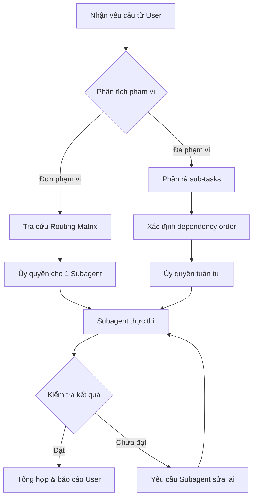

# 🧠 SUBAGENTS_INDEX.md — Điều phối Hệ thống Subagent HCProxy

> **Phiên bản:** 1.0.0  
> **Cập nhật:** 2026-10-05  
> **Vai trò:** Tệp này là **bộ điều phối trung tâm (Main Orchestrator Manifest)** — quy định cách phân chia tác vụ, định tuyến ngữ cảnh và cô lập phạm vi giữa các Subagent chuyên biệt trong dự án HCProxy.

---

## 1. Kiến trúc Tổng quan — Orchestrator & Subagents

```
┌──────────────────────────────────────────────────────────────┐
│                    MAIN ORCHESTRATOR                         │
│         (Phân tích yêu cầu → Định tuyến → Tổng hợp)        │
└──────────┬─────────────────┬─────────────────┬──────────────┘
           │                 │                 │
           ▼                 ▼                 ▼
┌──────────────────┐ ┌──────────────────┐ ┌──────────────────┐
│   🎨 Frontend    │ │   ⚙️ Backend &   │ │   🔧 DevOps &    │
│   Specialist     │ │   DB Specialist  │ │   Security       │
│                  │ │                  │ │   Specialist     │
│  ProxyApp/       │ │  ProxyServer/    │ │  HCProxy/ (root) │
│                  │ │  database/       │ │  .gitignore      │
│                  │ │                  │ │  scripts/        │
└──────────────────┘ └──────────────────┘ └──────────────────┘
```

**Nguyên tắc vận hành:**
1. Main Orchestrator **không trực tiếp viết code** — chỉ phân tích, định tuyến và tổng hợp kết quả.
2. Mỗi Subagent hoạt động **độc lập trong sandbox** thư mục được cấp phép.
3. Khi tác vụ xuyên biên giới (cross-boundary), Orchestrator phối hợp **tuần tự** để tránh xung đột file.

---

## 2. Ma trận Định tuyến (Routing Matrix)

Bảng dưới đây quy định Subagent nào xử lý yêu cầu nào. Orchestrator **bắt buộc** tra cứu bảng này trước khi ủy quyền.

| Loại yêu cầu người dùng | Subagent được giao | Tệp cấu hình chi tiết | Ưu tiên |
| --- | --- | --- | --- |
| Thiết kế UI, tạo trang mới, sửa layout | 🎨 **Frontend Specialist** | `.antigravity/subagents/frontend-specialist.md` | Duy nhất |
| Tạo/sửa Vue component, Pinia store | 🎨 **Frontend Specialist** | `.antigravity/subagents/frontend-specialist.md` | Duy nhất |
| Cấu hình Tailwind, responsive mobile | 🎨 **Frontend Specialist** | `.antigravity/subagents/frontend-specialist.md` | Duy nhất |
| Kết nối API từ frontend (Axios call) | 🎨 **Frontend Specialist** | `.antigravity/subagents/frontend-specialist.md` | Chính |
| Tạo/sửa API endpoint, Controller | ⚙️ **Backend Specialist** | `.antigravity/subagents/backend-specialist.md` | Duy nhất |
| Viết business logic, Service layer | ⚙️ **Backend Specialist** | `.antigravity/subagents/backend-specialist.md` | Duy nhất |
| Thiết kế/sửa DB schema, migration SQL | ⚙️ **Backend Specialist** | `.antigravity/subagents/backend-specialist.md` | Duy nhất |
| Xác thực JWT, mã hóa mật khẩu | ⚙️ **Backend Specialist** | `.antigravity/subagents/backend-specialist.md` | Duy nhất |
| Xử lý proxy forwarding (HTTP/SOCKS5) | ⚙️ **Backend Specialist** | `.antigravity/subagents/backend-specialist.md` | Duy nhất |
| Git add/commit/push | 🔧 **DevOps Specialist** | `.antigravity/subagents/devops-specialist.md` | Duy nhất |
| Quản lý ngrok tunnel | 🔧 **DevOps Specialist** | `.antigravity/subagents/devops-specialist.md` | Duy nhất |
| Cập nhật `.gitignore`, `README.md` | 🔧 **DevOps Specialist** | `.antigravity/subagents/devops-specialist.md` | Duy nhất |
| Kiểm soát bảo mật, audit secrets | 🔧 **DevOps Specialist** | `.antigravity/subagents/devops-specialist.md` | Duy nhất |
| Script PowerShell vận hành | 🔧 **DevOps Specialist** | `.antigravity/subagents/devops-specialist.md` | Duy nhất |

### 2.1 Xử lý Tác vụ Xuyên biên giới (Cross-boundary Tasks)

Khi yêu cầu người dùng ảnh hưởng đến **≥ 2 Subagent**, Orchestrator thực hiện:

```
Bước 1 → Phân rã tác vụ thành các sub-task đơn phạm vi.
Bước 2 → Xác định thứ tự thực thi (dependency order):
          Database schema → Backend API → Frontend integration
Bước 3 → Giao tuần tự cho từng Subagent.
Bước 4 → Truyền kết quả đầu ra (Handoff DTO) giữa các Subagent.
Bước 5 → Tổng hợp kết quả và báo cáo cho người dùng.
```

**Ví dụ chuỗi tác vụ xuyên biên giới:**

> *Yêu cầu: "Thêm tính năng quản lý danh sách proxy node"*

| Thứ tự | Subagent | Tác vụ | Đầu ra chuyển giao |
| --- | --- | --- | --- |
| 1 | ⚙️ Backend | Tạo migration `proxy_nodes`, viết Controller CRUD | Endpoint URL: `GET/POST/PUT/DELETE /api/proxynodes` |
| 2 | 🎨 Frontend | Tạo trang `PoolProxyManager.vue`, gọi API | Component hoàn chỉnh kết nối endpoint |
| 3 | 🔧 DevOps | Commit toàn bộ thay đổi | `feat(proxy): thêm CRUD quản lý proxy node` |

---

## 3. Nguyên tắc Chuyển giao Ngữ cảnh (Handoff Protocol)

Khi Subagent A hoàn tất tác vụ và Subagent B cần tiếp nhận, Orchestrator truyền **Handoff DTO** theo cấu trúc chuẩn sau:

### 3.1 DTO Contract — Backend → Frontend

Khi Backend Specialist tạo xong API endpoint, Orchestrator chuyển giao cho Frontend Specialist:

```json
{
  "handoff_type": "API_ENDPOINT_READY",
  "source_subagent": "backend-specialist",
  "target_subagent": "frontend-specialist",
  "payload": {
    "endpoint_url": "/api/proxynodes",
    "http_methods": ["GET", "POST", "PUT", "DELETE"],
    "request_schema": {
      "POST /api/proxynodes": {
        "body": {
          "name": "string (required)",
          "address": "string (required)",
          "port": "integer (required)",
          "protocol": "string (enum: HTTP, SOCKS5)",
          "is_active": "boolean (default: true)"
        }
      }
    },
    "response_schema": {
      "GET /api/proxynodes": {
        "status": 200,
        "body": "[{ id, name, address, port, protocol, is_active, created_at }]"
      }
    },
    "auth_required": true,
    "notes": "Header Authorization: Bearer <token> bắt buộc trên mọi request."
  }
}
```

### 3.2 DTO Contract — Frontend → DevOps

Khi Frontend Specialist hoàn tất, Orchestrator thông báo cho DevOps Specialist:

```json
{
  "handoff_type": "CODE_READY_FOR_COMMIT",
  "source_subagent": "frontend-specialist",
  "target_subagent": "devops-specialist",
  "payload": {
    "changed_files": [
      "ProxyApp/src/pages/PoolProxyManager.vue",
      "ProxyApp/src/stores/useProxyStore.js",
      "ProxyApp/src/router/index.js"
    ],
    "commit_scope": "proxy-app",
    "commit_type": "feat",
    "commit_description": "thêm trang quản lý danh sách proxy node"
  }
}
```

### 3.3 DTO Contract — Database Schema → Backend

Khi cần thay đổi DB schema trước khi viết API:

```json
{
  "handoff_type": "SCHEMA_MIGRATION_READY",
  "source_subagent": "backend-specialist",
  "target_subagent": "backend-specialist",
  "payload": {
    "migration_file": "database/migrations/00X_<description>.sql",
    "tables_affected": ["proxy_nodes"],
    "columns_added": ["last_health_check TIMESTAMPTZ"],
    "schema_snapshot_updated": true
  }
}
```

---

## 4. Quy tắc Cô lập Ngữ cảnh (Scope Isolation)

### 4.1 Phạm vi Thư mục Cấp phép

| Subagent | Thư mục ĐỌC & GHI | Thư mục CHỈ ĐỌC | Thư mục CẤM TRUY CẬP |
| --- | --- | --- | --- |
| 🎨 Frontend | `ProxyApp/` | `AGENT.md`, `docs/` | `ProxyServer/`, `database/`, `.git/` |
| ⚙️ Backend | `ProxyServer/`, `database/` | `AGENT.md`, `docs/` | `ProxyApp/`, `.git/` |
| 🔧 DevOps | `.gitignore`, `README.md`, `scripts/`, `deploy/` | Toàn bộ Monorepo (chỉ đọc) | Không sửa business logic hoặc UI code |

### 4.2 Quy tắc Vi phạm Phạm vi

```
NẾU Subagent cố gắng chỉnh sửa file ngoài phạm vi cấp phép:
  → Orchestrator CHẶN thao tác.
  → Ghi log cảnh báo.
  → Chuyển tác vụ cho Subagent đúng phạm vi.

NẾU tác vụ yêu cầu chỉnh sửa đồng thời nhiều phạm vi:
  → Orchestrator phân rã thành sub-tasks.
  → Giao tuần tự cho từng Subagent theo dependency order.
  → KHÔNG BAO GIỜ cho phép 2 Subagent ghi vào cùng 1 file.
```

### 4.3 Tệp Chia sẻ (Shared Resources)

Một số tệp được nhiều Subagent tham chiếu nhưng chỉ có **1 Subagent được phép chỉnh sửa**:

| Tệp | Chủ sở hữu (Owner) | Subagent khác: quyền |
| --- | --- | --- |
| `AGENT.md` | 🔧 DevOps | Chỉ đọc |
| `.gitignore` | 🔧 DevOps | Chỉ đọc |
| `README.md` | 🔧 DevOps | Chỉ đọc |
| `ProxyApp/.env.example` | 🎨 Frontend | Chỉ đọc |
| `ProxyServer/appsettings.Example.json` | ⚙️ Backend | Chỉ đọc |
| `database/schema.sql` | ⚙️ Backend | Chỉ đọc |

---

## 5. Quy trình Vận hành Orchestrator

### 5.1 Luồng Xử lý Yêu cầu



### 5.2 Checklist Trước khi Ủy quyền

Orchestrator **bắt buộc** kiểm tra trước khi giao tác vụ:

- [ ] Đã xác định đúng Subagent qua Routing Matrix.
- [ ] Tác vụ nằm trong phạm vi thư mục cấp phép của Subagent.
- [ ] Không có xung đột file với Subagent khác đang hoạt động.
- [ ] Handoff DTO đầy đủ nếu tác vụ phụ thuộc vào kết quả trước đó.
- [ ] Checklist nghiệm thu của Subagent được đính kèm trong yêu cầu.

---

## Phụ lục: Liên kết Tệp Cấu hình Subagent

| Subagent | Tệp cấu hình |
| --- | --- |
| 🎨 Frontend Specialist | [`.antigravity/subagents/frontend-specialist.md`](file:///c:/Users/Administrator/Desktop/HCProxy/.antigravity/subagents/frontend-specialist.md) |
| ⚙️ Backend & DB Specialist | [`.antigravity/subagents/backend-specialist.md`](file:///c:/Users/Administrator/Desktop/HCProxy/.antigravity/subagents/backend-specialist.md) |
| 🔧 DevOps & Security Specialist | [`.antigravity/subagents/devops-specialist.md`](file:///c:/Users/Administrator/Desktop/HCProxy/.antigravity/subagents/devops-specialist.md) |

---

> **📌 Ghi nhớ:** Tệp `SUBAGENTS_INDEX.md` phải được đọc bởi Orchestrator **trước mỗi tác vụ**. Khi có xung đột với hướng dẫn cụ thể trong tệp cấu hình Subagent, **tệp cấu hình Subagent được ưu tiên** cho phạm vi chuyên môn của nó, nhưng **tệp này được ưu tiên** cho quy tắc phối hợp và phân quyền.
